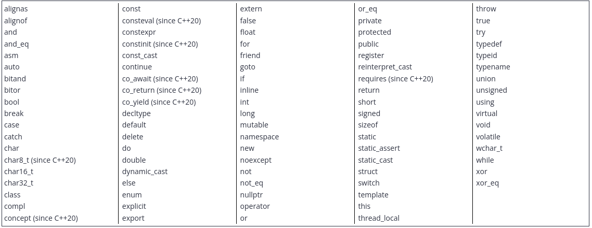

Keywords

C++ reserves a set of 92 words (as of C++23) for its own use

Here is a list of all the C++ keywords (through C++23):

Identifier values:

Identifier must start with letter, can contain, letter, number and underscores and identifieres are case sensitive.