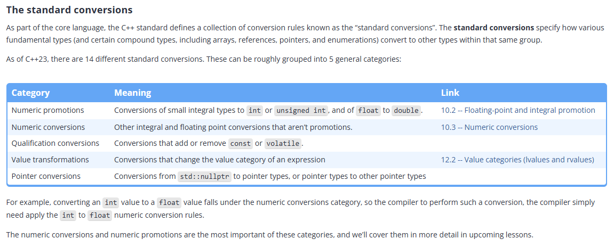
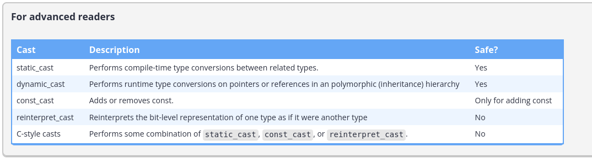

## Implicit Type Conversion Examples

```cpp
double d{ 3 }; // int value 3 implicitly converted to type double
d = 6; // int value 6 implicitly converted to type double
```

```cpp
float doSomething()
{
    return 3.0; // double value 3.0 implicitly converted to type float
}
```
```cpp
double division{ 4.0 / 3 }; // int value 3 implicitly converted to type double
```
```cpp
if (5) // int value 5 implicitly converted to type bool
{
}
```
```cpp
void doSomething(long l)
{
}

doSomething(3); // int value 3 implicitly converted to type long
```


## Standard Conversion Categories:




## What happens If compiler cannot convert the type ?

Program is likely to fail in compilation phase. Via a compile error.


**Keywords of this file:**
- Implicit and Explicit Conversionn
- Conversion Categories

## Natural Data Size of a CPU

In modern CPU's, they are designed in a way that they perform most and efficient with a data type called "natural data size" of value.

So in order to perform more, compiler will convert some narrower data types in "natural data" which is int or double.


This process is called **numeric promotion**.


## Numeric promotion

Because C++ is designed to be portable and performant across a wide range of architectures, the language designers did not want to assume a given CPU would be able to efficiently manipulate values that were narrower than the natural data size for that CPU.

To help address this challenge, C++ defines a category of type conversions informally called the numeric promotions. **A numeric promotion is the type conversion of certain narrower numeric types (such as a char) to certain wider numeric types (typically int or double) that can be processed efficiently.**

**All numeric promotions are value-preserving.** A value-preserving conversion (also called a safe conversion) is one where every possible source value can be converted into an equal value of the destination type.

Because promotions are safe, the compiler will freely use numeric promotion as needed, and will not issue a warning when doing so.

```cpp
#include <iostream>

int main() {
    char a = 50;  // char, bellekte 1 bayt (8 bit) yer kaplar
    char b = 60;

    // C++ bu satırda otomatik olarak sayısal yükseltme yapar:
    // 1. 'a' ve 'b' önce 'int'e yükseltilir (genellikle 4 bayt/32 bit).
    // 2. Toplama işlemi (50 + 60) 'int' olarak yapılır.
    // 3. Sonuç, bir 'int' değişkenine atanır.
    
    auto sonuc = a + b; 
    
    std::cout << "Sonuç: " << sonuc << std::endl;  // Çıktı: 110
    std::cout << "Sonucun tipi: " << typeid(sonuc).name() << std::endl; 
    // Çıktı (genellikle): i (yani int)

    return 0;
}
```

## Numeric promitions are also beneficial in reducing redundancy.

Numeric promotion solves another problem as well. Consider the case where you wanted to write a function to print a value of type int:
```cpp
#include <iostream>

void printInt(int x)
{
    std::cout << x << '\n';
}
```

While this is straightforward, what happens if we want to also be able to print a value of type short, or type char? If type conversions did not exist, we’d have to write a different print function for short and another one for char. And don’t forget another version for unsigned char, signed char, unsigned short, wchar_t, char8_t, char16_t, and char32_t! You can see how this quickly becomes unmanageable.

Numeric promotion comes to the rescue here: we can write functions that have int and/or double parameters (such as the printInt() function above). That same code can then be called with arguments of types that can be numerically promoted to match the types of the function parameters.

## Numeric promotion categories

Integral and floating point promotion.

Floating Promitions are straitghforward.

Check this out:

```cpp
Using the floating point promotion rules, a value of type float can be converted to a value of type double.

This means we can write a function that takes a double and then call it with either a double or a float value:

#include <iostream>

void printDouble(double d)
{
    std::cout << d << '\n';
}

int main()
{
    printDouble(5.0); // no conversion necessary
    printDouble(4.0f); // numeric promotion of float to double

    return 0;
}
```

## Integral promotions

The integral promotion rules are more complicated.


Using the integral promotion rules, the following conversions can be made:

Note: Dont forget, promotions are value-safe. So it should not erase any value while promoting.


- signed char or signed short can be converted to int.
- unsigned char, char8_t, and unsigned short can be converted to int if int can hold the entire range of the type, or unsigned int otherwise.


Example for it:

The above explanation states: If the unsigned type being converted does not exceed the signed range of the converted type, the conversion takes place. If it exceeds it, it is converted to the unsigned type.

Note: The range of int (32-bit) is -2,147,483,647 to 2,147,483,647

unsigned short range: 0 to 65535


If we are promoting unsigned short to int. We first of check that whether the range of unsigned short is subset of the range of signed int? if it is yes. Then convert it. 

But something strange here that all wider types has contains the unsigned range of types that narrow then them. For instance (unsigned char and signed short,  unsigned short and signed int, unsigned int and long.)

But in old systems it might not be the case so short and int can be has the same range in actual. So that is the shell to overcome this issue.


- If char is signed by default, it follows the signed char conversion rules above. If it is unsigned by default, it follows the unsigned char conversion rules above.

- bool can be converted to int, with false becoming 0 and true becoming 1.

Assuming an 8 bit byte and an int size of 4 bytes or larger (which is typical these days), the above basically means that **bool, char, signed char, unsigned char, signed short, and unsigned short all get promoted to int.**

There are a few other integral promotion rules that are used less often. These can be found at https://en.cppreference.com/w/cpp/language/implicit_conversion#Integral_promotion.

In most cases, this lets us write a function taking an int parameter, and then use it with a wide variety of other integral types. For example:
```cpp
#include <iostream>

void printInt(int x)
{
    std::cout << x << '\n';
}

int main()
{
    printInt(2);

    short s{ 3 }; // there is no short literal suffix, so we'll use a variable for this one
    printInt(s); // numeric promotion of short to int

    printInt('a'); // numeric promotion of char to int
    printInt(true); // numeric promotion of bool to int

    return 0;
}
```

There are two things worth noting here. First, on some architectures (e.g. with 2 byte ints) it is possible for some of the unsigned integral types to be promoted to unsigned int rather than int.

Second, some narrower unsigned types (such as unsigned char) may be promoted to larger signed types (such as int). So while integral promotion is value-preserving, it does not necessarily preserve the signedness (signed/unsigned) of the type.


## So the all cast and conversions for narrow to natural data (wider) is promotion? No.

Some widening type conversions (such as char to short, or int to long) are not considered to be numeric promotions in C++ (they are numeric conversions, which we’ll cover shortly in lesson 10.3 -- Numeric conversions). This is because such conversions do not assist in the goal of converting smaller types to larger types that can be processed more efficiently.

The distinction is mostly academic. However, in certain cases, the compiler will favor numeric promotions over numeric conversions. We’ll see examples where this makes a difference when we cover function overload resolution (in upcoming lesson 11.3 -- Function overload resolution and ambiguous matches).

**Keywords of the file:**
- Natural data size,
- why promotion is necessary? 
- Promotion (integral and floating point promotions), 
- unsigned and signed range rule for promotiong. 
- Not every conversion from narrower to wider is not promotion.

## Numeric Conversions Examples:

1. int to any integral types:
```cpp
short s = 3; // convert int to short
long l = 3; // convert int to long
char ch = s; // convert short to char
unsigned int u = 3; // convert int to unsigned int
```

2. Converting a floating point type to any other floating point type (excluding floating point promotions):
```cpp
float f = 3.0; // convert double to float
long double ld = 3.0; // convert double to long double
```

3. Converting a floating point type to any integral type:
```cpp
int i = 3.5; // convert double to int Note: This couldn't be done by braces initializtions. e.g: int i { 3.5 }
```

4. Converting an integral type to any floating point type:
```cpp
double d = 3; // convert int to double
```

5. Converting an integral type or a floating point type to a bool:
```cpp
bool b1 = 3; // convert int to bool
bool b2 = 3.0; // convert double to bool
```

## Numeric Conversions:

1. Safe Conversions. "Value-preserving conversions are safe numeric conversions where the destination type can exactly represent all possible values in the source type."

So how can we decide a conversion from type x to type y is safe? Check the range of the x and y. If y contains the x, then it is safe.

Example:

int to long. int range: [-2,1 milion to 2.1 milion] long? [-9 trilion to 9 triliaon] does range of the long contains the range of int? Yes. Then int to long conversions are safe. So you can get back this conversion and you will get the value exatly same as you had.

How it works? When Safe conversions done, it only change the bits that requires. So if we are trying to convert int (32-bit) to long (64-bit) it only adds bits to the left. 

2. Reinterpretive conversions are unsafe numeric conversions where the converted value may be different than the source value, but no data is lost. Signed/unsigned conversions fall into this category.

How it works:
Bits does not change. Just the way compiler interpret the bits is changed.

For example, when converting a signed int to an unsigned int:

```cpp
int main()
{
    int n1 { 5 };
    unsigned int u1 { n1 }; // okay: will be converted to unsigned int 5 (value preserved)

    int n2 { -5 };
    unsigned int u2 { n2 }; // bad: will result in large integer outside range of signed int

    return 0;
}
```

In the case of u1, the signed int value 5 is converted to unsigned int value 5. Thus, the value is preserved in this case.

3. Lossy conversions are unsafe numeric conversions where data may be lost during the conversion.

For example, double to int is a conversion that may result in data loss:
```cpp
int i = 3.0; // okay: will be converted to int value 3 (value preserved)
int j = 3.5; // data lost: will be converted to int value 3 (fractional value 0.5 lost)
```
Conversion from double to float can also result in data loss:


```cpp
float f = 1.2;        // okay: will be converted to float value 1.2 (value preserved)
float g = 1.23456789; // data lost: will be converted to float 1.23457 (precision lost)
```


Note that Promotions is sub-action of Conversion. So every promotion is a conversion but vice versa is not true.
**Keywords of this file:**
- What is Numeric Conversion?
- What are numberic conversion categories?
    - What is the Safe Conversion and how does it work?
    - What is Reinterpretive conversion and how does it work?
    - What is Lossy Conversion and how does it work?

    ## Narrowing conversions

In C++, a **narrowing conversion** is a potentially unsafe numeric conversion where the destination type may not be able to hold all the values of the source type.

The following conversions are defined to be narrowing:

- From a floating point type to an integral type.
- From a floating point type to a narrower or lesser ranked floating point type, unless the value being converted is constexpr and is in range of the destination type (even if the destination type doesn’t have the precision to store all the significant digits of the number).
- From an integral to a floating point type, unless the value being converted is constexpr and whose value can be stored exactly in the destination type.
- From an integral type to another integral type that cannot represent all values of the original type, unless the value being converted is constexpr and whose value can be stored exactly in the destination type. This covers both wider to narrower integral conversions, as well as integral sign conversions (signed to unsigned, or vice-versa).

In most cases, implicit narrowing conversions will result in compiler warnings, with the exception of signed/unsigned conversions (which may or may not produce warnings, depending on how your compiler is configured).

Narrowing conversions should be avoided as much as possible, because they are potentially unsafe, and thus a source of potential errors.

## What should be done about narrowing conversion?

Do it explictily.

```cpp
void someFcn(int i)
{
}

int main()
{
    double d{ 5.0 };

    someFcn(d); // bad: implicit narrowing conversion will generate compiler warning

    // good: we're explicitly telling the compiler this narrowing conversion is intentional
    someFcn(static_cast<int>(d)); // no warning generated

    return 0;
}
```

## Brace initialization disallows narrowing conversions

```cpp
int main()
{
    int i { 3.5 }; // won't compile
    int x = 3.5; // Valid.

    return 0;
}
```

## Some constexpr conversions aren’t considered narrowing

```cpp
#include <iostream>

int main()
{
    constexpr int n1{ 5 };   // note: constexpr
    unsigned int u1 { n1 };  // okay: conversion is NOT narrowing due to exclusion clause

    constexpr int n2 { -5 }; // note: constexpr
    unsigned int u2 { n2 };  // compile error: conversion is narrowing due to value change

    return 0;
}
```

Let’s apply the rule “From an integral type to another integral type that cannot represent all values of the original type, unless the value being converted is constexpr and whose value can be stored exactly in the destination type” to both of the conversions above.

In the case of n1 and u1, n1 is an int and u1 is an unsigned int, so this is a conversion from an integral type to another integral type that cannot represent all values of the original type. However, n1 is constexpr, and its value 5 can be represented exactly in the destination type (as unsigned value 5). Therefore, this is not considered to be a narrowing conversion, and we are allowed to list initialize u1 using n1.

In the case of n2 and u2, things are similar. Although n2 is constexpr, its value -5 cannot be represented exactly in the destination type, so this is considered to be a narrowing conversion, and because we are doing list initialization, the compiler will error and halt the compilation.
Ezoic

Strangely, conversions from a floating point type to an integral type do not have a constexpr exclusion clause, so these are always considered narrowing conversions even when the value to be converted is constexpr and fits in the range of the destination type:
```cpp
int n { 5.0 }; // compile error: narrowing conversion
```
Even more strangely, conversions from a constexpr floating point type to a narrower floating point type are not considered narrowing even when there is a loss of precision!

```cpp
constexpr double d { 0.1 };
float f { d }; // not narrowing, even though loss of precision results
```
Example for not narrowing conversion:
```cpp
int main()
{
    float f { 1.23456789 }; // not a narrowing conversion, even though precision lost!

    return 0;
}
```

**Key concepts of this chapter:**
- What is narrowing conversion?
- constexpr and narrowing conversion.

## Arithmetic Operators

Binary operator+ is given two operands, both of type int. Because both operands are of the same type, that type will be used to perform the calculation, and the value returned will also be of this same type. Thus, 2 + 3 will evaluate to int value 5.

But what happens when the operands of a binary operator are of different types?

??? y { 2 + 3.5 };
In this case, operator+ is being given one operand of type int and another of type double. Should the result of the operator be returned as an int, a double, or possibly something else altogether?

In C++, certain operators require that their operands be of the same type. If one of these operators is invoked with operands of different types, one or both of the operands will be implicitly converted to matching types using a set of rules called the usual arithmetic conversions. The matching type produced as a result of the usual arithmetic conversion rules is called the common type of the operands.

## The operators that require operands of the same type

The following operators require their operands to be of the same type:

The binary arithmetic operators: +, -, *, /, %
The binary relational operators: <, >, <=, >=, ==, !=
The binary bitwise arithmetic operators: &, ^, |
The conditional operator ?: (excluding the condition, which is expected to be of type bool)

## The usual arithmetic conversion rules

The usual arithmetic conversion rules are somewhat complex, so we’ll simplify a bit. The compiler has a ranked list of types that looks something like this:

1. long double (highest rank)
2. double
3. float
4. long long
5. long
6. int (lowest rank)

The following rules are applied to find a matching type:

Step 1:

- If one operand is an integral type and the other a floating point type, the integral operand is converted to the type of the floating point operand (no integral promotion takes place). 
- Otherwise, any integral operands are numerically promoted (see 10.2 -- Floating-point and integral promotion).


Step 2:
- After promotion, if one operand is signed and the other unsigned, special rules apply (see below)
- Otherwise, the operand with lower rank is converted to the type of the operand with higher rank.

Lets take a senarios:
Scenario 1:
```cpp
    char + long;
``` 

For step 1 and subrule 1: is one of them in the type of floating point and the other one is integral? No.

For step 1 and subrule 2: Then promotion: `char + long` promoted to `int + long`

Then step 2 and subrule 1: if the signed statues are opposite, use special rules. which is not the case.
Then step 2 and subrule 2: then since the operand types are not the same turn lower to hight so `int + long` convert into int to long `long + long`.


**For advanced readers**

### The special matching rules for integral operands with different signs:

- If the rank of the unsigned operand is greater than or equal to the rank of the signed operand, the signed operand is converted to the type of the unsigned operand.

Example: We have `unsigned x` and `signed y`  if `x` >= `y` then turn `signed y` to `unsigned y`. e.g.
`unsigned int x + signed int y` = `unsigned int x + unsigned int y`
or
`unsigned long x + signed int y` = `unsigned long x + unsigned long y` (step 2, special rules)

- If the type of the signed operand can represent all the values of the type of the unsigned operand, the type of the unsigned operand is converted to the type of the signed operand.

Example: We have `unsigned x` and `signed y`  if `range of signed y` consist of `range of unsigned x` then turn `unsigned x` to `signed y`. e.g.

`long + unsigned int` Since [-9,1 trillion to 9,1 trillion] consist [0 to 4,2 million] then turn unsigned int to signed. So
`long + unsigned int` to `signed int` then convert the int to long. (Since the long has more priority)

- Otherwise both operands are converted to the corresponding unsigned type of the signed operand.

INSPECT FOR ALL USUAL ARITHMETIC CONVERSIONS BY [HERE](https://en.cppreference.com/w/cpp/language/usual_arithmetic_conversions.html)

- Otherwise turn signed to unsigned type.

## Examples:

```cpp
#include <iostream>
#include <typeinfo> // for typeid()

int main()
{
    int i{ 2 };
    std::cout << typeid(i).name() << '\n'; // show us the name of the type for i

    double d{ 3.5 };
    std::cout << typeid(d).name() << '\n'; // show us the name of the type for d

    std::cout << typeid(i + d).name() << ' ' << i + d << '\n'; // show us the type of i + d

    return 0;
}
```

```cpp
#include <iostream>
#include <typeinfo> // for typeid()

int main()
{
    short a{ 4 };
    short b{ 5 };
    std::cout << typeid(a + b).name() << ' ' << a + b << '\n'; // show us the type of a + b

    return 0;
}
```

## Signed and unsigned issues

```cpp
#include <iostream>
#include <typeinfo> // for typeid()

int main()
{
    std::cout << typeid(5u-10).name() << ' ' << 5u - 10 << '\n'; // 5u means treat 5 as an unsigned integer

    return 0;
}
```

```cpp
#include <iostream>

int main()
{
    std::cout << std::boolalpha << (-3 < 5u) << '\n';

    return 0;
}
```

## std::common_type and std::common_type_t

In future lessons, we’ll encounter cases where it is useful to know what the common type of two type is. `std::common_type` and the useful type alias `std::common_type_t` (both defined in the `<type_traits>` header) can be used for just this purpose.

For example, `std::common_type_t<int, double>` returns the common type of int and double, and `std::common_type_t<unsigned int, long>` returns the common type of unsigned int and long.

**Key concepts of this file:**
    - What is arithmetic conversion?
    - Arithmeic conversition priotiry order.
    - Arithemtic conversion rules:
        - Steps for arithmetic conversions:
        - Numerical promotion for arithmetic conversion
        - Signed and unsigned issues and **special rules**
        

## Casting types:

C++ supports 5 different types of casts: **static_cast**, **dynamic_cast**, **const_cast**, **reinterpret_cast**, and **C-style casts**. The first four are sometimes referred to as named casts.

### Casting table:



## C-style cast

casting that we know in popular languages: `double x = (double)5`

C++ also provides an alternative form of C-style cast known as a **function-style cast**, which resembles a function call:

`double x = double(5);` or `cout << double(x) / y << endl` **function-cast**.

There are a couple of significant reasons that C-style casts are generally avoided in modern C++.

## static_cast example:

```cpp
#include <iostream>

int main()
{
    char c { 'a' };
    std::cout << static_cast<int>(c) << '\n'; // prints 97 rather than a

    return 0;
}
```

static_cast provides compile-time type checking. 


```cpp
// a C-style string literal can't be converted to an int, so the following is an invalid conversion
int x { static_cast<int>("Hello") }; // invalid: will produce compilation error
```

## Casting vs initializing a temporary object

Let’s say we have some variable x that we need to convert to an int. There are two conventional ways we can do this:

    static_cast<int>(x), which returns a temporary int object direct-initialized with x.
    int { x }, which creates a temporary int object direct-list-initialized with x.

We should avoid int ( x ), which is a C-style cast. This will return a temporary int direct-initialized with the value of x (like we’d expect from the syntax), but it also has the other downsides mentioned in the C-style cast section (like allowing the possibility of performing a dangerous conversion).

There are (at least) three notable differences between the static_cast and the direct-list-initialized temporary:

    1. int { x } uses list initialization, which disallows narrowing conversions. This is great when initializing a variable, because we rarely intend to lose data in such cases. But when using a cast, it is presumed we know what we’re doing, and if we want to do a cast that might lose some data, we should be able to do that. The narrowing conversion restriction can be an impediment in this case.


```cpp
#include <iostream>

int main()
{
    int x { 10 };
    int y { 4 };

    // We want to do floating point division, so one of the operands needs to be a floating point type
    std::cout << double{x} / y << '\n'; // okay if int is 32-bit, narrowing if x is 64-bit
}
```

In this example, we have decided to convert x to a double so we can do floating-point division rather than integer division. On a 32-bit architecture, this will work fine (because a double can represent all the values that can be stored in a 32-bit int, so it isn’t a narrowing conversion). But on a 64-bit architecture, this is not the case, so converting a 64-bit int to a double is a narrowing conversion. And since list initialization disallows narrowing conversions, this won’t compile on architectures where int is 64-bits.

2. static_cast makes it clearer that we are intending to perform a conversion. Although the static_cast is more verbose than the direct-list-initialized alternative, in this case, that’s a good thing, as it makes the conversion easier to spot and search for. That ultimately makes your code safer and easier to understand.
3. Direct-list-initializion of a temporary only allows single-word type names. Due to a weird syntax quirk, there are several places within C++ where only single-word type names are allowed (the C++ standard calls these names “simple type specifiers”). So while int { x } is a valid conversion syntax, unsigned int { x } is not.


You can see this for yourself in the following example, which produces a compile error:
```cpp
#include <iostream>

int main()
{
    unsigned char c { 'a' };
    std::cout << unsigned int { c } << '\n'; //Not single word initialization.

    return 0;
}
```

**Key concepts of this file:**
    - Casting types
    - C style casting and function style casting.
    - Casting vs initiazling temproray object. What is the difference? (Read the paragraph)
    - Brace initialization and single word initialization.

## Type aliases

In C++, **using** is a keyword that creates an alias for an existing data type. To create such a type alias, we use the **using** keyword, followed by a name for the type alias, followed by an equals sign and an existing data type. For example:

`using Distance = double; // define Distance as an alias for type double`

Once defined, a type alias can be used anywhere a type is needed. For example, we can create a variable with the type alias name as the type:

```cpp
Distance milesToDestination{ 3.4 }; // defines a variable of type double
```

## The scope of a type alias

Because scope is a property of an identifier, **type alias identifiers follow the same scoping rules as variable identifiers**: 

## Typedefs

A typedef (which is short for “type definition”) is an older way of creating an alias for a type. To create a typedef alias, we use the typedef keyword:

```cpp
// The following aliases are identical
typedef long Miles;
//typedef Miles long is valid also.
using Miles = long;
```

Second, the syntax for typedefs can get ugly with more complex types. For example, here is a hard-to-read typedef, along with an equivalent (and slightly easier to read) type alias:
```cpp
typedef int (*FcnType)(double, char); // FcnType hard to find
using FcnType = int(*)(double, char); // FcnType easier to find
```

Da fuq?

## Using type aliases to make complex types easier to read

```cpp
#include <string> // for std::string
#include <vector> // for std::vector
#include <utility> // for std::pair

bool hasDuplicates(std::vector<std::pair<std::string, int>> pairlist)
{
    // some code here
    return false;
}

int main()
{
     std::vector<std::pair<std::string, int>> pairlist;

     return 0;
}
```

What about this?

```cpp
#include <string> // for std::string
#include <vector> // for std::vector
#include <utility> // for std::pair

using VectPairSI = std::vector<std::pair<std::string, int>>; // make VectPairSI an alias for this crazy type

bool hasDuplicates(VectPairSI pairlist) // use VectPairSI in a function parameter
{
    // some code here
    return false;
}

int main()
{
     VectPairSI pairlist; // instantiate a VectPairSI variable

     return 0;
}
```

**Key concepts of this file:**
- Type aliases
- Scope of type aliases
- How can you define type alises? using and typedef keywords.

## Type deduction for initialized variables


Type deduction (also sometimes called type inference) is a feature that allows the compiler to deduce the type of an object from the object’s initializer. When defining a variable, type deduction can be invoked by using the auto keyword can be used in place of the variable’s type:

```cpp
int main()
{
    auto d { 5.0 }; // 5.0 is a double literal, so d will be deduced as a double
    auto i { 1 + 2 }; // 1 + 2 evaluates to an int, so i will be deduced as an int
    auto x { i }; // i is an int, so x will be deduced as an int

    auto y { 10.0f } //since 10.9 is parsed as float by suffix f, it is deduced that y has a typeid().name() float.

    return 0;
}
```

## Keyword auto via const and constexpr

```cpp
int main()
{
    int a { 5 };            // a is an int

    const auto b { 5 };     // b is a const int
    constexpr auto c { 5 }; // c is a constexpr int

    return 0;
}
```

## Type deduction must have something to deduce from

```cpp
#include <iostream>

void foo()
{
}

int main()
{
    auto a;           // The compiler is unable to deduce the type of a
    auto b { };       // The compiler is unable to deduce the type of b
    auto c { foo() }; // Invalid: c can't have type incomplete type void

    return 0;
}
```

## Type deduction drops const from the deduced type !!!

```cpp
int main()
{
    const int a { 5 }; // a has type const int
    auto b { a };      // b has type int (const dropped)

    return 0;
}
```

## Type deduction for string literals

For historical reasons, string literals in C++ have a strange type. Therefore, the following probably won’t work as expected:
```cpp
auto s { "Hello, world" }; // s will be type const char*, not std::string
```

f you want the type deduced from a string literal to be std::string or std::string_view, you’ll need to use the s or sv literal suffixes (introduced in lessons 5.7 -- 


```cpp
#include <string>
#include <string_view>

int main()
{
    using namespace std::literals; // easiest way to access the s and sv suffixes

    auto s1 { "goo"s };  // "goo"s is a std::string literal, so s1 will be deduced as a std::string
    auto s2 { "moo"sv }; // "moo"sv is a std::string_view literal, so s2 will be deduced as a std::string_view

    return 0;
}
```

## Type deduction and constexpr

```cpp
int main()
{
    constexpr double a { 3.4 };  // a has type const double (constexpr not part of type, const is implicit)

    auto b { a };                // b has type double (const dropped)
    const auto c { a };          // c has type const double (const dropped but reapplied)
    constexpr auto d { a };      // d has type const double (const dropped but implicitly reapplied by constexpr)

    return 0;
}
```

**Key concepts of this file:**
    - auto keyword
    - initialization and suffixes matters using auto keyword.
    - auto keyword has some clue to initialize.
    - meaningless for auto keyword initializations.
    - string suffixes using std:literals;
    - auto keywords drop const and constexpr


## auto keyword can be used in return type of functions.

```cpp
auto add(int x, int y)
{
    return x + y;
}
```

What about the returning types different? Consider:
```cpp
auto someFcn(bool b)
{
    if (b)
        return 5; // return type int
    else
        return 6.7; // return type double
}
```

In the above function, the two return statements return values of different types, so the compiler will give an error.

If such a case is desired for some reason, you can either explicitly specify a return type for your function (in which case the compiler will try to implicitly convert any non-matching return expressions to the explicit return type), or you can explicitly convert all of your return statements to the same type. In the example above, the latter could be done by changing 5 to 5.0, but static_cast can also be used for non-literal types.

In other cases, the return type of a function may either be long and complex, or not be that obvious. In such cases, auto can be used to simplify:

```cpp
// let compiler determine the return type of unsigned short + char
auto add(unsigned short x, char y)
{
    return x + y;
}
```

What it will return? Discussed in 11.8 -- Function templates with multiple template types.

## Downsides of return type deduction
```cpp
#include <iostream>

auto foo();

int main()
{
    std::cout << foo() << '\n'; // the compiler has only seen a forward declaration at this point

    return 0;
}

auto foo()
{
    return 5;
}
```

Some machines might give the error declared: `error C3779: 'foo': a function that returns 'auto' cannot be used before it is defined.`

## Trailing return type syntax

The auto keyword can also be used to declare functions using a trailing return syntax, where the return type is specified after the rest of the function prototype.

Consider the following function:
```cpp
int add(int x, int y)
{
  return (x + y);
}
```

Using the trailing return syntax, this could be equivalently written as:

```cpp

auto add(int x, int y) -> int
{
  return (x + y);
}
```

In this case, auto does not perform type deduction -- it is just part of the syntax to use a trailing return type.

### Why would you want to use this? Here are some reasons:

1. For functions with complex return types, a trailing return type can make the function easier to read:
```cpp

#include <type_traits> // for std::common_type

std::common_type_t<int, double> compare(int, double);         // harder to read (where is the name of the function in this mess?)
auto compare(int, double) -> std::common_type_t<int, double>; // easier to read (we don't have to read the return type unless we care)
```
2. The trailing return type syntax can be used to align the names of your functions, which makes consecutive function declarations easier to read:
```cpp

auto add(int x, int y) -> int;
auto divide(double x, double y) -> double;
auto printSomething() -> void;
auto generateSubstring(const std::string &s, int start, int len) -> std::string;
```
### For advanced readers

3. If we have a function whose return type must be deduced based on the type of the function parameters, a normal return type will not suffice, because the compiler has not yet seen the parameters at that point.

```cpp

#include <type_traits>
// note: decltype(x) evaluates to the type of x

std::common_type_t<decltype(x), decltype(y)> add(int x, double y);         // Compile error: compiler hasn't seen definitions of x and y yet
auto add(int x, double y) -> std::common_type_t<decltype(x), decltype(y)>; // ok
```
4. The trailing return syntax is also required for some advanced features of C++, such as lambdas (which we cover in lesson 20.6 -- Introduction to lambdas (anonymous functions)).

For now, we recommend the continued use of the traditional function return syntax except in situations that require the trailing return syntax.

## Type deduction can’t be used for function parameter types

```cpp
#include <iostream>

void addAndPrint(auto x, auto y)
{
    std::cout << x + y << '\n';
}

int main()
{
    addAndPrint(2, 3); // case 1: call addAndPrint with int parameters
    addAndPrint(4.5, 6.7); // case 2: call addAndPrint with double parameters

    return 0;
}
```

**Key concepts of this file:**
    - Type deduction (auto keyword) via functions
    - Trailing return types
    - Trailing return type syntax and when and how to use.
    - auto keyword and forward declarations.

Keyword learned: auto
