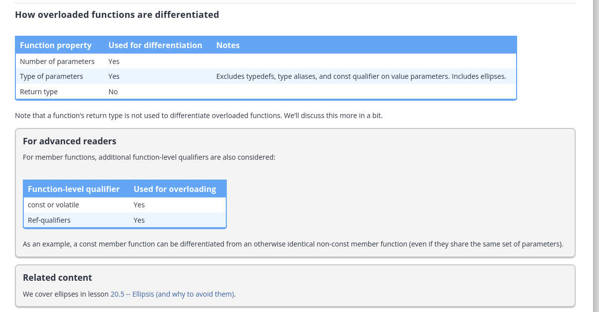

## Function overloading

How overloaded functions are differentiated? 

Tables:



Examples for all:

### Overloading based on number of parameters
```cpp
int add(int x, int y)
{
    return x + y;
}

int add(int x, int y, int z)
{
    return x + y + z;
}
```


### Overloading based on type of parameters

```cpp
int add(int x, int y); // integer version
double add(double x, double y); // floating point version
double add(int x, double y); // mixed version
double add(double x, int y); // mixed version

typedef int Height; // typedef
using Age = int; // type alias

void print(int value);
void print(Age value); // not differentiated from print(int)
void print(Height value); // not differentiated from print(int)
```

For parameters passed by value, the const qualifier is also not considered. Therefore, the following functions are not considered to be differentiated:

```cpp
void print(int);
void print(const int); // not differentiated from print(int)
```

### For advanced readers

We haven’t covered ellipsis yet, but ellipsis parameters are considered to be a unique type of parameter:
```cpp
void foo(int x, int y);
void foo(int x, ...); // differentiated from foo(int, int)
```

Thus a call to foo(4, 5) will match to foo(int, int), not foo(int, ...).


**Key concepts of this file:**
    - Differentiation and overloading function rules