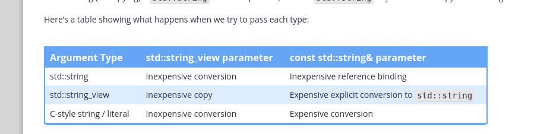

## Passing arguments of a different type to a const lvalue reference parameter

In lesson 12.4 -- Lvalue references to const, we noted that a const lvalue reference can bind to a value of a different type, as long as that value is convertible to the type of the reference. The conversion creates a temporary object that the reference parameter can then bind to.

The primary motivation for allowing this is so that we can pass a value as an argument to either a value parameter or a const reference parameter in exactly the same way:

```cpp
#include <iostream>

void printVal(double d)
{
    std::cout << d << '\n';
}

void printRef(const double& d)
{
    std::cout << d << '\n';
}

int main()
{
    printVal(5); // 5 converted to TEMPORARY double, copied to parameter d
    printRef(5); // 5 converted to TEMPORARY double, bound to parameter d

    return 0;
}
```

## When to use pass by value vs pass by reference

For most C++ beginners, the choice of whether to use pass by value or pass by reference isn’t very obvious. Fortunately, there’s a straightforward rule of thumb that will serve you well in the majority cases.

- Fundamental types and enumerated types are cheap to copy, so they are typically passed by value.
- Class types can be expensive to copy (sometimes significantly so), so they are typically passed by const reference.


### Tip

Here’s a partial list of other interesting cases:

The following are often passed by value (because it is more efficient):

- Enumerated types (unscoped and scoped enumerations).
- Views and spans (e.g. `std::string_view`, std::span).
- Types that mimic references or (non-owning) pointers (e.g. iterators, std::reference_wrapper).
- Cheap-to-copy class types that have value semantics (e.g. std::pair with elements of fundamental types, std::optional, std::expected).

Pass by reference should be used for the following:

- Arguments that need to be modified by the function.
- Types that aren’t copyable (such as std::ostream).
- Types where copying has ownership implications that we want to avoid (e.g. std::unique_ptr, std::shared_ptr).
- Types that have virtual functions or are likely to be inherited from (due to object slicing concerns, covered in lesson 25.9 -- Object slicing).


## The cost of pass by value vs pass by reference Advanced

First, we need to consider the cost of initializing the function parameter. With pass by value, initialization means making a copy. The cost of copying an object is generally proportional to two things:

- The size of the object. Objects that use more memory take more time to copy.
- Any additional setup costs. Some class types do additional setup when they are instantiated (e.g. such as opening a file or database, or allocating a certain amount of dynamic memory to hold an object of a variable size). These setup costs must be paid each time an object is copied.

On the other hand, binding a reference to an object is always fast (about the same speed as copying a fundamental type).

Second, we need to consider the cost of using the function parameter. When setting up a function call, the compiler may be able to optimize by placing a reference or copy of a passed-by-value argument (if it is small in size) into a CPU register (which is fast to access) rather than into RAM (which is slower to access).

Each time a value parameter is used, the running program can directly access the storage location (CPU register or RAM) of the copied argument. However, when a reference parameter is used, there is usually an extra step. The running program must first directly access the storage location (CPU register or RAM) allocated to the reference, in order to determine which object is being referenced. Only then can it access the storage location of the referenced object (in RAM).

Therefore, each use of a value parameter is a single CPU register or RAM access, whereas each use of a reference parameter is a single CPU register or RAM access plus a second RAM access.


We can now answer these question of why we don’t pass everything by reference:

- For objects that are cheap to copy, the cost of copying is similar to the cost of binding, but accessing the objects is faster and the compiler is likely to be able to optimize better.
- For objects that are expensive to copy, the cost of the copy dominates other performance considerations.

## For function parameters, prefer `std::string_view` over const `std::string&` in most cases

One question that comes up often in modern C++: when writing a function that has a string parameter, should the type of the parameter be const `std::string&` or `std::string_view`?

In most cases, `std::string_view` is the better choice, as it can handle a wider range of argument types efficiently. A `std::string_view` parameter also allows the caller to pass in a substring without having to copy that substring into its own string first.

## Why `std::string_view` parameters are more efficient than const `std::string&` (Advanced)

In C++, a string argument will typically be a `std::string`, a `std::string_view`, or a C-style string/string literal.

As reminders:

- If the type of an argument does not match the type of the corresponding parameter, the compiler will try to implicitly convert the argument to match the type of the parameter.
- Converting a value creates a temporary object of the converted type.
- Creating (or copying) a `std::string_view` is inexpensive, as `std::string_view` does not make a copy of the string it is viewing.
- Creating (or copying) a `std::string` can be expensive, as each `std::string` object makes a copy of the string.

Here’s a table showing what happens when we try to pass each type:




With a `std::string_view` value parameter:

- If we pass in a `std::string` argument, the compiler will convert the `std::string` to a `std::string_view`, which is inexpensive, so this is fine.
- If we pass in a `std::string_view` argument, the compiler will copy the argument into the parameter, which is inexpensive, so this is fine.
- If we pass in a C-style string or string literal, the compiler will convert these to a `std::string_view`, which is inexpensive, so this is fine.

With a const `std::string&` reference parameter:

- If we pass in a `std::string` argument, the parameter will reference bind to the argument, which is inexpensive, so this is fine.
- If we pass in a `std::string_view` argument, the compiler will refuse to do an implicit conversion, and produce a compilation error. We can use static_cast to do an explicit conversion (to `std::string`), but this conversion is expensive (since `std::string` will make a copy of the string being viewed). Once the conversion is done, the parameter will reference bind to the result, which is inexpensive. But we’ve made an expensive copy to do the conversion, so this isn’t great.
- If we pass in a C-style string or string literal, the compiler will implicitly convert this to a `std::string`, which is expensive. So this isn’t great either.

Thus, a const `std::string&` parameter only handles `std::string` arguments inexpensively.


The same, in code form:
```cpp
#include <iostream>
#include <string>
#include <string_view>

void printSV(std::string_view sv)
{
    std::cout << sv << '\n';
}

void printS(const std::string& s)
{
    std::cout << s << '\n';
}

int main()
{
    std::string s{ "Hello, world" };
    std::string_view sv { s };

    // Pass to `std::string_view` parameter
    printSV(s);              // ok: inexpensive conversion from std::string to std::string_view
    printSV(sv);             // ok: inexpensive copy of std::string_view
    printSV("Hello, world"); // ok: inexpensive conversion of C-style string literal to std::string_view

    // pass to `const std::string&` parameter
    printS(s);              // ok: inexpensive bind to std::string argument
    printS(sv);             // compile error: cannot implicit convert std::string_view to std::string
    printS(static_cast<std::string>(sv)); // bad: expensive creation of std::string temporary
    printS("Hello, world"); // bad: expensive creation of std::string temporary

    return 0;
}
```