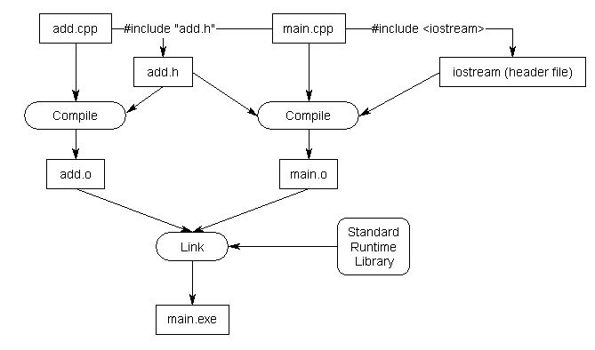

## Header files:

C++ code files (with a .cpp extension) are not the only files commonly seen in C++ programs. The other type of file is called a header file. Header files usually have a .h extension, but you will occasionally see them with a .hpp extension or no extension at all.

Conventionally, header files are used to propagate a bunch of related forward declarations into a code file.

Consider the following program:

```cpp
#include <iostream>

int main()
{
    std::cout << "Hello, world!";
    return 0;
}

```
This program prints “Hello, world!” to the console using std::cout. However, this program never provided a definition or declaration for std::cout, so how does the compiler know what std::cout is?

The answer is that std::cout has been forward declared in the “iostream” header file. When we #include <iostream>, we’re requesting that the preprocessor copy all of the content (including forward declarations for std::cout) from the file named “iostream” into the file doing the #include.

Let’s write a header file to relieve us of this burden. Writing a header file is surprisingly easy, as header files only consist of two parts:

    1. A header guard, which we’ll discuss in more detail in the next lesson (2.12 -- Header guards).
    2. The actual content of the header file, which should be the forward declarations for all of the identifiers we want other files to be able to see.

When the preprocessor processes the #include "add.h" line, it copies the contents of add.h into the current file at that point. Because our add.h contains a forward declaration for function add(), that forward declaration will be copied into main.cpp. The end result is a program that is functionally the same as the one where we manually added the forward declaration at the top of main.cpp.




## Do not #include .cpp files

Why?

There are number of reasons for this:

    Doing so can cause naming collisions between source files.
    In a large project it can be hard to avoid one definition rules (ODR) issues.
    Any change to such a .cpp file will cause both the .cpp file and any other .cpp file that includes it to recompile, which can take a long time. Headers tend to change less often than source files.
    It is non-conventional to do so.

## Angled brackets vs double quotes 

When we use angled brackets, we’re telling the preprocessor that this is a header file we didn’t write ourselves. The preprocessor will search for the header only in the directories specified by the include directories. The include directories are configured as part of your project/IDE settings/compiler settings, and typically default to the directories containing the header files that come with your compiler and/or OS. The preprocessor will not search for the header file in your project’s source code directory.

When we use double-quotes, we’re telling the preprocessor that this is a header file that we wrote. The preprocessor will first search for the header file in the current directory. If it can’t find a matching header there, it will then search the include directories.

## Why doesn’t iostream have a .h extension?

When the language was standardized by the ANSI committee, they decided to move all of the names used in the standard library into the std namespace to help avoid naming conflicts with user-declared identifiers. However, this presented a problem: if they moved all the names into the std namespace, none of the old programs (that included iostream.h) would work anymore!

To work around this issue, C++ introduced new header files that lack the .h extension. These new header files declare all names inside the std namespace. This way, older programs that include #include <iostream.h> do not need to be rewritten, and newer programs can #include <iostream>.

Modern C++ now contains 4 sets of header files:


## The order of inclusion for header files

If your header files are written properly and #include everything they need, the order of inclusion shouldn’t matter.

Now consider the following scenario: let’s say header A needs declarations from header B, but forgets to include it. In our code file, if we include header B before header A, our code will still compile! This is because the compiler will compile all the declarations from B before it compiles the code from A that depends on those declarations.

## Header file best practices

    Always include header guards (we’ll cover these next lesson).
    Do not define variables and functions in header files (for now).
    Give a header file the same name as the source file it’s associated with (e.g. grades.h is paired with grades.cpp).
    Each header file should have a specific job, and be as independent as possible. For example, you might put all your declarations related to functionality A in A.h and all your declarations related to functionality B in B.h. That way if you only care about A later, you can just include A.h and not get any of the stuff related to B.
    Be mindful of which headers you need to explicitly include for the functionality that you are using in your code files, to avoid inadvertent transitive includes.
    A header file should #include any other headers containing functionality it needs. Such a header should compile successfully when #included into a .cpp file by itself.
    Only #include what you need (don’t include everything just because you can).
    Do not #include .cpp files.
    Prefer putting documentation on what something does or how to use it in the header. It’s more likely to be seen there. Documentation describing how something works should remain in the source files.