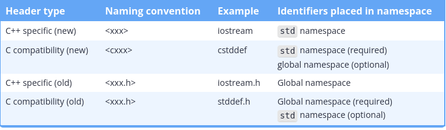

#  Nested functions are not supported

A function whose definition is placed inside another function is a nested function. Unlike some other programming languages, in C++, functions cannot be nested. The following program is not legal:

```cpp
#include <iostream>

int main()
{
    void foo() // Illegal: this function is nested inside function main()
    {
        std::cout << "foo!\n";
    }

    foo(); // function call to foo()

    return 0;
}
```

## What is return value?

The return expression produces the value to be returned. The return value is a **COPY** of that value.

But this word copy is controversional. Why?

Because when we inspect the code below:

```cpp

int function(){
    int y = 19;
    return y;
}

int x = function();
```
What we actually doing is creating a value y in memory and COPYING it to the x so we have 2 y values indeed. 

But when it comes to non-primitive types like strings. We are actually TRANSFERRING this data. Check this out:

```cpp
std::string function(){
    return "....'y. .e.......";
}

std::string secret = function();
```

What we are doing it is creating a string value NOT IN FUNCTION but IN THE SCOPE OF secret VARIABLE. So we actually did NOT create this object 2 times.


Compilers had priority for this type of situation, followings:

Pri 1: RVO (Return Value Optimization)
Which means creating the object NOT IN THE FUNCTION body BUT in the caller body.

Pri 2: Pointing out that variable which created IN FUNCTION body. But variable in caller body just pointing that variable. 

Pri 3: Copying the value.


So how we can understand which technique that c++ used to return this value?

Compiler will check from top to down in priorities:

It tries all of them.


Class that does RVO, besides copy and move.

class RVO_Class {
public:
    RVO_Class() { std::cout << "RVO_Class: Created (Default Constructor)\n"; }
    ~RVO_Class() { std::cout << "RVO_Class: Destroyed! (Destructor)\n"; }

    // Copy consturctor
    RVO_Class(const RVO_Class&) { std::cout << "RVO_Class: COPIED!\n"; }
    
    // Move constructor
    RVO_Class(RVO_Class&&) noexcept { std::cout << "RVO_Class: MOVED!\n"; }
};

Class that only be moveable.

class MoveOnly_Class {
public:
    std::string name;
    MoveOnly_Class(std::string n) : name(std::move(n)) { 
        std::cout << "MoveOnly_Class: Created (" << name << ")\n"; 
    }
    ~MoveOnly_Class() { 
        std::cout << "MoveOnly_Class: Destuctred (" << name << ")\n"; 
    }

    // Move consturctor: fast
    MoveOnly_Class(MoveOnly_Class&& other) noexcept : name(std::move(other.name)) {
        std::cout << "MoveOnly_Class: MOVED! (" << name << ")\n";
        other.name = "emptied";
    }

    // Move constuctor.
    MoveOnly_Class(const MoveOnly_Class&) =  { std::cout << "MoveOnly_Class: MOVED!\n"; }
    
    // Copy consturctor: Prohibited.
    MoveOnly_Class& operator=(const MoveOnly_Class&) = delete;
};


Class that only be copiyable.

class CopyOnly_Class {
public:
    CopyOnly_Class() { std::cout << "CopyOnly_Class: Created (Default)\n"; }
    ~CopyOnly_Class() { std::cout << "CopyOnly_Class: Destroyed\n"; }

    // Copy Constructor.
    CopyOnly_Class(const CopyOnly_Class&) {
        std::cout << "CopyOnly_Class: COPIED!\n";
    }

    // Move constructor: PROHIBITED OPENLY!
    // It forces to not use moving.
    CopyOnly_Class(CopyOnly_Class&&) = delete;
};


## Explicit function calls to main() are disallowed.


```cpp
void foo()
{
    main(); // Compile error: main not allowed to be called explicitly
}

void main() // Compile error: main not allowed to have non-int return type
{
    foo();
}
```

## Exit codes:

```cpp
#include <cstdlib> // for EXIT_SUCCESS and EXIT_FAILURE

int main()
{
    return EXIT_SUCCESS; // OR EXIT_FAILIURE;
}
```

## A value-returning function that does not return a value will produce undefined behavior

A function that returns a value is called a **value-returning** function. A function is value-returning if the return type is anything other than void.

## Functions can only return a single value

A value-returning function can only return a single value back to the caller each time it is called.

## Parameter name of a function?

In a function definition, the name of a function parameter is optional. Therefore, in cases where a function parameter needs to exist but is not used in the body of the function, you can simply omit the name. A parameter without a name is called an unnamed parameter:

```cpp
void doSomething(int) // ok: unnamed parameter will not generate warning
{
}
```

## Optional(?) Why need we a function that has a unused parameter?

You’re probably wondering why we’d write a function that has a parameter whose value isn’t used. This happens most often in cases similar to the following:

    Let’s say we have a function with a single parameter. Later, the function is updated in some way, and the value of the parameter is no longer needed. If the now-unused function parameter were simply removed, then every existing call to the function would break (because the function call would be supplying more arguments than the function could accept). This would require us to find every call to the function and remove the unneeded argument. This might be a lot of work (and require a lot of retesting). It also might not even be possible (in cases where we did not control all of the code calling the function). So instead, we might leave the parameter as it is, and just have it do nothing.

    ## Definition of a local variable.

Variables defined inside the **body of a function** are called local variables.
Function parameters are also generally considered to be local variables.

## Lifetime, Scope?

Lifetime is a runtime property, and scope is a compile-time property.

## Example about what is happening

```cpp
#include <iostream>

int add(int x, int y) // x and y are created and enter scope here
{
    // x and y are usable only within add()
    return x + y;
} // y and x go out of scope and are destroyed here

int main()
{
    int a{ 5 }; // a is created, initialized, and enters scope here
    int b{ 6 }; // b is created, initialized, and enters scope here

    // a and b are usable only within main()

    std::cout << add(a, b) << '\n'; // calls add(5, 6), where x=5 and y=6

    return 0;
} // b and a go out of scope and are destroyed here
```

To enhance your understanding of how all this fits together, let’s trace through this program in a little more detail. The following happens, in order:

    - Execution starts at the top of main.
    - main variable a is created and given value 5.
    - main variable b is created and given value 6.
    - Function add is called with argument values 5 and 6.
    - add parameters x and y are created and initialized with values 5 and 6 respectively.
    - The expression x + y is evaluated to produce the value 11.
    - add copies the value 11 back to caller main.
    - add parameters y and x are destroyed.
    - main prints 11 to the console.
    - main returns 0 to the operating system.
    - main variables b and a are destroyed.

And we’re done.

Note that if function add were to be called twice, parameters x and y would be created and destroyed twice -- once for each call. In a program with lots of functions and function calls, variables are created and destroyed often.

## Temproray objects:

Temporary object (also sometimes called an anonymous object) is an unnamed object that is used to hold a value that is only needed for a short period of time. Temporary objects are generated by the compiler when they are needed.
Inspect:

```cpp
#include <iostream>

int getValueFromUser()
{
 	std::cout << "Enter an integer: ";
	int input{};
	std::cin >> input;

	return input; // return the value of input back to the caller
}

int main()
{
	std::cout << getValueFromUser() << '\n'; // where does the returned value get stored?

	return 0;
}
```
where is the value that is copied back to the caller stored? We haven’t defined any variables in main(). The answer is that the return value is stored in a temporary object. This temporary object is then passed to std::cout to be printed.


## Refactoring ?

When a function becomes too long, too complicated, or hard to understand, it can be split into multiple sub-functions. This is called refactoring.

## Compilation order

```cpp
#include <iostream>

int main()
{
    std::cout << "The sum of 3 and 4 is: " << add(3, 4) << '\n';
    return 0;
}

int add(int x, int y)
{
    return x + y;
}
```

Any issues?

Error: add.cpp(5) : error C3861: 'add': identifier not found

The reason this program doesn’t compile is because the compiler compiles the contents of code files sequentially. 

How can we fix it?

1. Reorder the declaration order.

2. Use **forward** declaration:

A forward declaration allows us to tell the compiler about the existence of an identifier before actually defining the identifier.

Result of forward declaration:

```cpp
#include <iostream>

int add(int x, int y); // forward declaration of add() (using a function declaration) int add(int, int); // valid function declaration

int main()
{
    std::cout << "The sum of 3 and 4 is: " << add(3, 4) << '\n'; // this works because we forward declared add() above
    return 0;
}

int add(int x, int y) // even though the body of add() isn't defined until here
{
    return x + y;
}
```

## What about forgetting the function body?

The answer is: it depends. If a forward declaration is made, but the function is never called, the program will compile and run fine. However, if a forward declaration is made and the function is called, but the program never defines the function, the program will compile okay, but the linker will complain that it can’t resolve the function call.

## Pure declarations ?

Declarations that aren’t definitions are called pure declarations.

TODO: Fill the 2.9 https://www.learncpp.com/cpp-tutorial/naming-collisions-and-an-introduction-to-namespaces/

# About compilation

Before each file getting compile it goes a preprocessor state. In this state compiler makes some bunch of changes in your code.

Whenever preprocessor done its job the output is called as translation unit.

When preprocessor run, it looks for, from top to bottom, for preprocessor directives. They start with # symbols.

Directive **#include**:

When you #include a file, the preprocessor replaces the #include directive with the contents of the included file. The included contents are then preprocessed (which may result in additional #includes being preprocessed recursively), then the rest of the file is preprocessed.

Consider the following program:

```cpp

#include <iostream>

int main()
{
    std::cout << "Hello, world!\n";
    return 0;
}

```

When the preprocessor runs on this program, the preprocessor will replace #include <iostream> with the contents of the file named “iostream” and then preprocess the included content and the rest of the file.

Directive **Macro defines**:

In C++, a macro is a rule that defines how input text is converted into replacement output text.

The #define directive can be used to create a macro.

There are two basic types of macros: object-like macros, and function-like macros.

Object-like macros can be defined in one of two ways:

```cpp
#define IDENTIFIER
#define IDENTIFIER substitution_text
```

The identifier for a macro uses the same naming rules as normal identifiers: they can use letters, numbers, and underscores, cannot start with a number, and should not start with an underscore. By convention, macro names are typically all uppercase, separated by underscores.

Object-like macros with substitution text:

```cpp
#include <iostream>

#define MY_NAME "Alex"

int main()
{
    std::cout << "My name is: " << MY_NAME << '\n';

    return 0;
}
```

The output of preprocessor is:

```cpp
// The contents of iostream are inserted here

int main()
{
    std::cout << "My name is: " << "Alex" << '\n';

    return 0;
}
```

Object-like macros without a substituation text:

Conditional compilation:

The conditional compilation preprocessor directives allow you to specify under what conditions something will or won’t compile. There are quite a few different conditional compilation directives, but we’ll only cover a few that are used the most often: #ifdef, #ifndef, and #endif.

The #ifdef preprocessor directive allows the preprocessor to check whether an identifier has been previously defined via #define. If so, the code between the #ifdef and matching #endif is compiled. If not, the code is ignored.

```cpp

#include <iostream>

#define PRINT_JOE

int main()
{
#ifdef PRINT_JOE
    std::cout << "Joe\n"; // will be compiled since PRINT_JOE is defined
#endif

#ifdef PRINT_BOB
    std::cout << "Bob\n"; // will be excluded since PRINT_BOB is not defined
#endif

    return 0;
}
```
#ifndef is the opposite of #ifdef, in that it allows you to check whether an identifier has NOT been #defined yet.

```cpp
#include <iostream>

int main()
{
#ifndef PRINT_BOB
    std::cout << "Bob\n";
#endif

    return 0;
}
```

# #if 0 ?

One more common use of conditional compilation involves using #if 0 to exclude a block of code from being compiled (as if it were inside a comment block):

```cpp
#include <iostream>

int main()
{
    std::cout << "Joe\n";

#if 0 // Don't compile anything starting here
    std::cout << "Bob\n";
    std::cout << "Steve\n";
#endif // until this point

    return 0;
}
```

# The scope of #defines

Directives are resolved before compilation, from top to bottom on a **file-by-file** basis.

And since #include directive just copy the content of the file so we can copy our macros. Check this out:

Alex.h:

```cpp
#define MY_NAME "Alex"
```

main.cpp:

```cpp

#include "Alex.h" // copies #define MY_NAME from Alex.h here
#include <iostream>

int main()
{
	std::cout << "My name is: " << MY_NAME << '\n'; // preprocessor replaces MY_NAME with "Alex"

	return 0;
}

```

Once the preprocessor has finished, all defined identifiers from that file are discarded. This means that directives are only valid from the point of definition to the end of the file in which they are defined. Directives defined in one file do not have any impact on other files (unless they are #included into another file). For example:

function.cpp:

```cpp
#include <iostream>

void doSomething()
{
#ifdef PRINT
    std::cout << "Printing!\n";
#endif
#ifndef PRINT
    std::cout << "Not printing!\n";
#endif
}
```

main.cpp:

```cpp

void doSomething(); // forward declaration for function doSomething()

#define PRINT

int main()
{
    doSomething();

    return 0;
}

```

Output will be:

```text
Not printing!
```

## Header files:

C++ code files (with a .cpp extension) are not the only files commonly seen in C++ programs. The other type of file is called a header file. Header files usually have a .h extension, but you will occasionally see them with a .hpp extension or no extension at all.

Conventionally, header files are used to propagate a bunch of related forward declarations into a code file.

Consider the following program:

```cpp
#include <iostream>

int main()
{
    std::cout << "Hello, world!";
    return 0;
}

```
This program prints “Hello, world!” to the console using std::cout. However, this program never provided a definition or declaration for std::cout, so how does the compiler know what std::cout is?

The answer is that std::cout has been forward declared in the “iostream” header file. When we #include <iostream>, we’re requesting that the preprocessor copy all of the content (including forward declarations for std::cout) from the file named “iostream” into the file doing the #include.

Let’s write a header file to relieve us of this burden. Writing a header file is surprisingly easy, as header files only consist of two parts:

    1. A header guard, which we’ll discuss in more detail in the next lesson (2.12 -- Header guards).
    2. The actual content of the header file, which should be the forward declarations for all of the identifiers we want other files to be able to see.

When the preprocessor processes the #include "add.h" line, it copies the contents of add.h into the current file at that point. Because our add.h contains a forward declaration for function add(), that forward declaration will be copied into main.cpp. The end result is a program that is functionally the same as the one where we manually added the forward declaration at the top of main.cpp.


## Do not #include .cpp files

Why?

There are number of reasons for this:

    Doing so can cause naming collisions between source files.
    In a large project it can be hard to avoid one definition rules (ODR) issues.
    Any change to such a .cpp file will cause both the .cpp file and any other .cpp file that includes it to recompile, which can take a long time. Headers tend to change less often than source files.
    It is non-conventional to do so.

## Angled brackets vs double quotes 

When we use angled brackets, we’re telling the preprocessor that this is a header file we didn’t write ourselves. The preprocessor will search for the header only in the directories specified by the include directories. The include directories are configured as part of your project/IDE settings/compiler settings, and typically default to the directories containing the header files that come with your compiler and/or OS. The preprocessor will not search for the header file in your project’s source code directory.

When we use double-quotes, we’re telling the preprocessor that this is a header file that we wrote. The preprocessor will first search for the header file in the current directory. If it can’t find a matching header there, it will then search the include directories.

## Why doesn’t iostream have a .h extension?

When the language was standardized by the ANSI committee, they decided to move all of the names used in the standard library into the std namespace to help avoid naming conflicts with user-declared identifiers. However, this presented a problem: if they moved all the names into the std namespace, none of the old programs (that included iostream.h) would work anymore!

To work around this issue, C++ introduced new header files that lack the .h extension. These new header files declare all names inside the std namespace. This way, older programs that include #include <iostream.h> do not need to be rewritten, and newer programs can #include <iostream>.

Modern C++ now contains 4 sets of header files:




## The order of inclusion for header files

If your header files are written properly and #include everything they need, the order of inclusion shouldn’t matter.

Now consider the following scenario: let’s say header A needs declarations from header B, but forgets to include it. In our code file, if we include header B before header A, our code will still compile! This is because the compiler will compile all the declarations from B before it compiles the code from A that depends on those declarations.

## Header file best practices

    Always include header guards (we’ll cover these next lesson).
    Do not define variables and functions in header files (for now).
    Give a header file the same name as the source file it’s associated with (e.g. grades.h is paired with grades.cpp).
    Each header file should have a specific job, and be as independent as possible. For example, you might put all your declarations related to functionality A in A.h and all your declarations related to functionality B in B.h. That way if you only care about A later, you can just include A.h and not get any of the stuff related to B.
    Be mindful of which headers you need to explicitly include for the functionality that you are using in your code files, to avoid inadvertent transitive includes.
    A header file should #include any other headers containing functionality it needs. Such a header should compile successfully when #included into a .cpp file by itself.
    Only #include what you need (don’t include everything just because you can).
    Do not #include .cpp files.
    Prefer putting documentation on what something does or how to use it in the header. It’s more likely to be seen there. Documentation describing how something works should remain in the source files.

    
## Header Guards:

Consider the situation:

In upcoming examples, we’ll define some functions inside header files. You generally shouldn’t do this.

We are doing so here because it is the most effective way to demonstrate some concepts using functionality we’ve already covered.

square.h:
```cpp
int getSquareSides()
{
    return 4;
}
```

wave.h:
```cpp
#include "square.h"
```

main.cpp:
```cpp
#include "square.h"
#include "wave.h"

int main()
{
    return 0;
}

```

Result is:

```cpp

int getSquareSides()  // from square.h
{
    return 4;
}

int getSquareSides() // from wave.h (via square.h)
{
    return 4;
}

int main()
{
    return 0;
}

```

The good news is that we can avoid the above problem via a mechanism called a header guard (also called an include guard). Header guards are conditional compilation directives that take the following form:


```cpp
#ifndef SOME_UNIQUE_NAME_HERE
#define SOME_UNIQUE_NAME_HERE

// your declarations (and certain types of definitions) here

#endif
```

When this header is #included, the preprocessor will check whether SOME_UNIQUE_NAME_HERE has been previously defined in this translation unit. If this is the first time we’re including the header, SOME_UNIQUE_NAME_HERE will not have been defined. Consequently, it #defines SOME_UNIQUE_NAME_HERE and includes the contents of the file. If the header is included again into the same file, SOME_UNIQUE_NAME_HERE will already have been defined from the first time the contents of the header were included, and the contents of the header will be ignored (thanks to the #ifndef).

**All of your header files should have header guards on them.** SOME_UNIQUE_NAME_HERE can be any name you want, but by convention is set to the full filename of the header file, typed in all caps, using underscores for spaces or punctuation. For example, square.h would have the header guard:

square.h

```cpp
#ifndef SQUARE_H
#define SQUARE_H

int getSquareSides()
{
    return 4;
}

#endif
```

Review of our first example:

square.h:

```cpp
#ifndef SQUARE_H
#define SQUARE_H

int getSquareSides()
{
    return 4;
}

#endif
```

wave.h:

```cpp

#ifndef WAVE_H
#define WAVE_H

#include "square.h"

#endif

```

main.cpp

```cpp

#include "square.h"
#include "wave.h"

int main()
{
    return 0;
}
```

Result of main.cpp:

```cpp
// Square.h included from main.cpp
#ifndef SQUARE_H // square.h included from main.cpp
#define SQUARE_H // SQUARE_H gets defined here

// and all this content gets included
int getSquareSides()
{
    return 4;
}

#endif // SQUARE_H

#ifndef WAVE_H // wave.h included from main.cpp
#define WAVE_H
#ifndef SQUARE_H // square.h included from wave.h, SQUARE_H is already defined from above
#define SQUARE_H // so none of this content gets included

int getSquareSides()
{
    return 4;
}

#endif // SQUARE_H
#endif // WAVE_H

int main()
{
    return 0;
}
```

## #pragma once (short for "pragmatic information")

Modern compilers support a simpler, alternate form of header guards using the #pragma preprocessor directive:

#pragma once serves the same purpose as header guards: to avoid a header file from being included multiple times. With traditional header guards, the developer is responsible for guarding the header (by using preprocessor directives #ifndef, #define, and #endif). With #pragma once, we’re requesting that the compiler guard the header. How exactly it does this is an implementation-specific detail.

Warning

The #pragma directive was designed for compiler implementers to use for whatever purposes they desire. As such, which pragmas are supported and what meaning those pragmas have is completely implementation-specific. With the exception of #pragma once, do not expect a pragma that works on one compiler to be supported by another.

## Summary of Header Guards:

Header guards are designed to ensure that the contents of a given header file are not copied more than once into any single file, in order to prevent duplicate definitions.

Duplicate declarations are fine -- but even if your header file is composed of all declarations (no definitions) it’s still a best practice to include header guards.

Note that header guards do not prevent the contents of a header file from being copied (once) into separate project files. This is a good thing, because we often need to reference the contents of a given header from different project files.