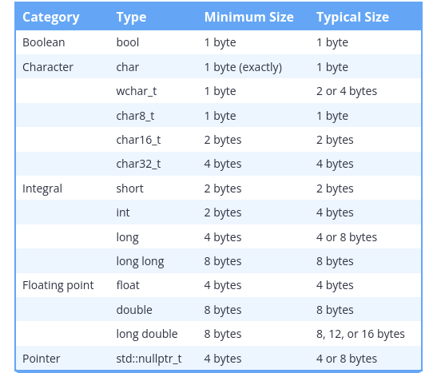

## Data storage size of fundemental types:

    An object must occupy at least 1 byte (so that each object has a distinct memory address).
    A byte must be at least 8 bits.
    The integral types char, short, int, long, and long long have a minimum size of 8, 16, 16, 32, and 64 bits respectively.
    char and char8_t are exactly 1 byte (at least 8 bits).



## The sizeof operator


In order to determine the size of data types on a particular machine, C++ provides an operator named sizeof. The sizeof operator is a unary operator that takes either a type or a variable, and returns the size of an object of that type (in bytes). You can compile and run the following program to find out how large some of your data types are:

```cpp
#include <iomanip> // for std::setw (which sets the width of the subsequent output)
#include <iostream>
#include <climits> // for CHAR_BIT

int main()
{
    std::cout << "A byte is " << CHAR_BIT << " bits\n\n";

    std::cout << std::left; // left justify output

    std::cout << std::setw(16) << "bool:" << sizeof(bool) << " bytes\n";
    std::cout << std::setw(16) << "char:" << sizeof(char) << " bytes\n";
    std::cout << std::setw(16) << "short:" << sizeof(short) << " bytes\n";
    std::cout << std::setw(16) << "int:" << sizeof(int) << " bytes\n";
    std::cout << std::setw(16) << "long:" << sizeof(long) << " bytes\n";
    std::cout << std::setw(16) << "long long:" << sizeof(long long) << " bytes\n";
    std::cout << std::setw(16) << "float:" << sizeof(float) << " bytes\n";
    std::cout << std::setw(16) << "double:" << sizeof(double) << " bytes\n";
    std::cout << std::setw(16) << "long double:" << sizeof(long double) << " bytes\n";

    return 0;
}
```

Output on my machine is:

```plaintext
A byte is 8 bits

bool:           1 bytes
char:           1 bytes
short:          2 bytes
int:            4 bytes
long:           8 bytes
long long:      8 bytes
float:          4 bytes
double:         8 bytes
long double:    16 bytes
```

Note: sizeof does not include dynamically allocated memory used by an object. We discuss dynamic memory allocation in a future lesson.