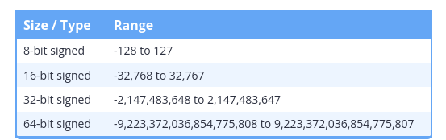

## Signed integer ranges:

Signed integer ranges

As you learned in the last section, a variable with n bits can hold 2n possible values. But which specific values? We call the set of specific values that a data type can hold its range. The range of an integer variable is determined by two factors: its size (in bits), and whether it is signed or not.

For example, an 8-bit signed integer has a range of -128 to 127. This means an 8-bit signed integer can store any integer value between -128 and 127 (inclusive) safely.

Here’s a table containing the range of signed integers of different sizes:



## Division In C++

When doing division with two integers (called integer division), C++ always produces an integer result. Since integers can’t hold fractional values, any fractional portion is simply dropped (not rounded!).

```cpp
#include <iostream>

int main()
{
    std::cout << 8 / 5 << '\n';
    return 0;
}
```