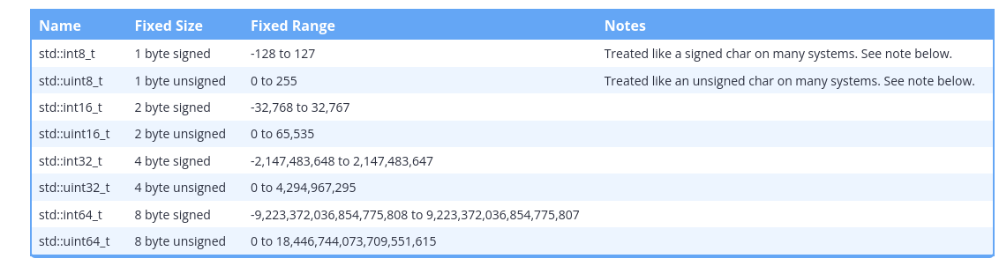

## Fixed width integers:

Fixed-width integers

To address the above issues, C++11 provides an alternate set of integer types that are guaranteed to be the same size on any architecture. Because the size of these integers is fixed, they are called fixed-width integers.

The fixed-width integers are defined (in the <cstdint>\ header) as follows:




Example:

```cpp
#include <cstdint> // for fixed-width integers
#include <iostream>

int main()
{
    std::int32_t x { 32767 }; // x is always a 32-bit integer
    x = x + 1;                // so 32768 will always fit
    std::cout << x << '\n';

    return 0;
}
```

## Warning: std::int8_t and std::uint8_t typically behave like chars

Due to an oversight in the C++ specification, modern compilers typically treat std::int8_t and std::uint8_t (and the corresponding fast and least fixed-width types, which we’ll introduce in a moment) the same as signed char and unsigned char respectively. Thus on most modern systems, the 8-bit fixed-width integral types will behave like char types.

As a quick teaser:
```cpp
#include <cstdint> // for fixed-width integers
#include <iostream>

int main()
{
    std::int8_t x { 65 };   // initialize 8-bit integral type with value 65
    std::cout << x << '\n'; // You're probably expecting this to print 65

    return 0;
}
```

## Fast and least integral types 

To help address the above downsides, C++ also defines two alternative sets of integers that are guaranteed to exist.

The fast types (std::int_fast#_t and std::uint_fast#_t) provide the fastest signed/unsigned integer type with a width of at least # bits (where # = 8, 16, 32, or 64). For example, std::int_fast32_t will give you the fastest signed integer type that’s at least 32-bits. By fastest, we mean the integral type that can be processed most quickly by the CPU.

The least types (std::int_least#_t and std::uint_least#_t) provide the smallest signed/unsigned integer type with a width of at least # bits (where # = 8, 16, 32, or 64). For example, std::uint_least32_t will give you the smallest unsigned integer type that’s at least 32-bits.

```cpp
#include <cstdint> // for fast and least types
#include <iostream>

int main()
{
	std::cout << "least 8:  " << sizeof(std::int_least8_t)  * 8 << " bits\n";
	std::cout << "least 16: " << sizeof(std::int_least16_t) * 8 << " bits\n";
	std::cout << "least 32: " << sizeof(std::int_least32_t) * 8 << " bits\n";
	std::cout << '\n';
	std::cout << "fast 8:  "  << sizeof(std::int_fast8_t)   * 8 << " bits\n";
	std::cout << "fast 16: "  << sizeof(std::int_fast16_t)  * 8 << " bits\n";
	std::cout << "fast 32: "  << sizeof(std::int_fast32_t)  * 8 << " bits\n";

	return 0;
}
```

Output is:

```plaintext
least 8:  8 bits
least 16: 16 bits
least 32: 32 bits

fast 8:  8 bits
fast 16: 32 bits
fast 32: 32 bits
```

You can see that std::int_least16_t is 16-bits, whereas std::int_fast16_t is actually 32-bits. This is because on the author’s machine, 32-bit integers are faster to process than 16-bit integers.

As another example, let’s assume we’re on an architecture that has only 16-bit and 64-bit integral types. std::int32_t would not exist, whereas std::least_int32_t (and std::fast_int32_t) would be 64 bits.

However, these fast and least integers have their own downsides. First, not many programmers actually use them, and a lack of familiarity can lead to errors. Then the fast types can also lead to memory wastage, as their actual size may be significantly larger than indicated by their name.

Most seriously, because the size of the fast/least integers is implementation-defined, your program may exhibit different behaviors on architectures where they resolve to different sizes. For example:

```cpp
#include <cstdint>
#include <iostream>

int main()
{
    std::uint_fast16_t sometype { 0 };
    sometype = sometype - 1; // intentionally overflow to invoke wraparound behavior

    std::cout << sometype << '\n';

    return 0;
}
```
This code will produce different results depending on whether std::uint_fast16_t is 16, 32, or 64 bits! This is exactly what we were trying to avoid by using fixed-width integers in the first place!

## What is std::size_t?


```cpp
#include <iostream>

int main()
{
    std::cout << sizeof(int) << '\n';

    return 0;
}
```

On the author’s machine, this prints:

```plaintext
4
```

Pretty simple, right? We can infer that operator sizeof returns an integer value -- but what integral type is that return value? An int? A short? The answer is that sizeof returns a value of type std::size_t. std::size_t is an alias for an implementation-defined unsigned integral type. In other words, the compiler decides if std::size_t is an unsigned int, an unsigned long, an unsigned long long, etc…

Much like an integer can vary in size depending on the system, std::size_t also varies in size. std::size_t is guaranteed to be unsigned and at least 16 bits, but on most systems will be equivalent to the address-width of the application. That is, for 32-bit applications, std::size_t will typically be a 32-bit unsigned integer, and for a 64-bit application, std::size_t will typically be a 64-bit unsigned integer.

## The sizeof operator returns a value of type std::size_t


```cpp
#include <cstddef> // for std::size_t
#include <iostream>

int main()
{
	std::cout << sizeof(std::size_t) << '\n';

	return 0;
}
```

## std::size_t imposes an upper limit on the size of an object 

The sizeof operator must be able to return the byte-size of an object as a value of type std::size_t. Therefore, the byte-size of an object can be no larger than the largest value std::size_t can hold.

If it were possible to create a larger object, sizeof would not be able to return its byte-size, as it would be outside the range that a std::size_t could hold. Thus, creating an object with a size (in bytes) larger than the largest value an object of type std::size_t can hold is invalid (and will cause a compile error).

For example, let’s assume that std::size_t has a size of 4 bytes on our system. An unsigned 4-byte integral type has range 0 to 4,294,967,295. Therefore, a 4-byte std::size_t object can hold any value from 0 to 4,294,967,295. Any object with a byte-size of 0 to 4,294,967,295 could have it’s size returned in a value of type std::size_t, so this is fine. However, if the byte-size of an object were larger than 4,294,967,295 bytes, then sizeof would not be able to return the size of that object accurately, as the value would be outside the range of a std::size_t. Therefore, no object larger than 4,294,967,295 bytes could be created on this system.