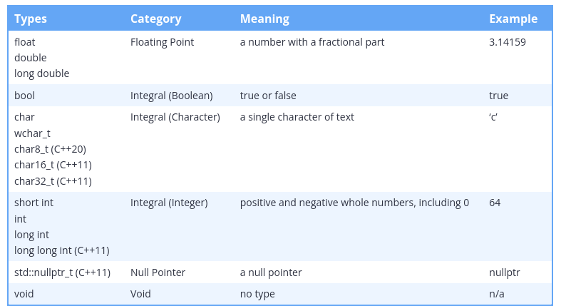
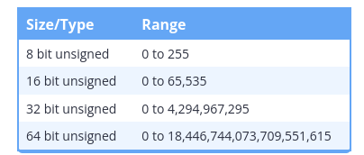

## Memory Addresses:

Each memory address refers to a 1 byte. A byte is a group of bits that are operated on as a unit. The modern standard is that a byte is comprised of 8 sequential bits. But byte do not have to consist of 8 bits.

## Fundamental data types



## Other set of types:

C++ contains three sets of types.

The first two are built-in to the language itself (and do not require the inclusion of a header to use):

    1. The “fundamental data types” provide the most the basic and essential data types.
    2. The “compound data types” provide more complex data types and allow for the creation of custom (user-defined) types. We cover these in lesson 12.1 -- Introduction to compound data types.

    3. The third (and largest) set of types is provided by the C++ standard library. Because the standard library is included in all C++ distributions, these types are broadly available and have been standardized for compatibility. Use of the types in the standard library requires the inclusion of the appropriate header and linking in the standard library.


## The _t suffix

Many of the types defined in newer versions of C++ (e.g. std::nullptr_t) use a _t suffix. This suffix means “type”, and it’s a common nomenclature applied to modern types.

If you see something with a _t suffix, it’s probably a type. But many types don’t have a _t suffix, so this isn’t consistently applied.


## Void type

Void is the easiest of the data types to explain. Basically, void means “no type”!

Void is our first example of an incomplete type. An incomplete type is a type that has been declared but not yet defined.

## Data storage size of fundemental types:

    An object must occupy at least 1 byte (so that each object has a distinct memory address).
    A byte must be at least 8 bits.
    The integral types char, short, int, long, and long long have a minimum size of 8, 16, 16, 32, and 64 bits respectively.
    char and char8_t are exactly 1 byte (at least 8 bits).


## The sizeof operator


In order to determine the size of data types on a particular machine, C++ provides an operator named sizeof. The sizeof operator is a unary operator that takes either a type or a variable, and returns the size of an object of that type (in bytes). You can compile and run the following program to find out how large some of your data types are:

```cpp
#include <iomanip> // for std::setw (which sets the width of the subsequent output)
#include <iostream>
#include <climits> // for CHAR_BIT

int main()
{
    std::cout << "A byte is " << CHAR_BIT << " bits\n\n";

    std::cout << std::left; // left justify output

    std::cout << std::setw(16) << "bool:" << sizeof(bool) << " bytes\n";
    std::cout << std::setw(16) << "char:" << sizeof(char) << " bytes\n";
    std::cout << std::setw(16) << "short:" << sizeof(short) << " bytes\n";
    std::cout << std::setw(16) << "int:" << sizeof(int) << " bytes\n";
    std::cout << std::setw(16) << "long:" << sizeof(long) << " bytes\n";
    std::cout << std::setw(16) << "long long:" << sizeof(long long) << " bytes\n";
    std::cout << std::setw(16) << "float:" << sizeof(float) << " bytes\n";
    std::cout << std::setw(16) << "double:" << sizeof(double) << " bytes\n";
    std::cout << std::setw(16) << "long double:" << sizeof(long double) << " bytes\n";

    return 0;
}
```

Output on my machine is:

```plaintext
A byte is 8 bits

bool:           1 bytes
char:           1 bytes
short:          2 bytes
int:            4 bytes
long:           8 bytes
long long:      8 bytes
float:          4 bytes
double:         8 bytes
long double:    16 bytes
```

Note: sizeof does not include dynamically allocated memory used by an object. We discuss dynamic memory allocation in a future lesson.

## Signed integer ranges:

Signed integer ranges

As you learned in the last section, a variable with n bits can hold 2n possible values. But which specific values? We call the set of specific values that a data type can hold its range. The range of an integer variable is determined by two factors: its size (in bits), and whether it is signed or not.

For example, an 8-bit signed integer has a range of -128 to 127. This means an 8-bit signed integer can store any integer value between -128 and 127 (inclusive) safely.

Here’s a table containing the range of signed integers of different sizes:


## Division In C++

When doing division with two integers (called integer division), C++ always produces an integer result. Since integers can’t hold fractional values, any fractional portion is simply dropped (not rounded!).

```cpp
#include <iostream>

int main()
{
    std::cout << 8 / 5 << '\n';
    return 0;
}
```

## Defining unsigned numbers:

```cpp
unsigned short us;
unsigned int ui;
unsigned long ul;
unsigned long long ull;
```

## Unsigned integer range



## When to used unsigned numbers?

There are still a few cases in C++ where it’s okay / necessary to use unsigned numbers.

First, unsigned numbers are preferred when dealing with bit manipulation (covered in chapter O -- that’s a capital ‘o’, not a ‘0’). They are also useful when well-defined wrap-around behavior is required (useful in some algorithms like encryption and random number generation).

Second, use of unsigned numbers is still unavoidable in some cases, mainly those having to do with array indexing. We’ll talk more about this in the lessons on arrays and array indexing.

Also note that if you’re developing for an embedded system (e.g. an Arduino) or some other processor/memory limited context, use of unsigned numbers is more common and accepted (and in some cases, unavoidable) for performance reasons.


## Fixed width integers:

Fixed-width integers

To address the above issues, C++11 provides an alternate set of integer types that are guaranteed to be the same size on any architecture. Because the size of these integers is fixed, they are called fixed-width integers.

The fixed-width integers are defined (in the <cstdint>\ header) as follows:


Example:

```cpp
#include <cstdint> // for fixed-width integers
#include <iostream>

int main()
{
    std::int32_t x { 32767 }; // x is always a 32-bit integer
    x = x + 1;                // so 32768 will always fit
    std::cout << x << '\n';

    return 0;
}
```

## Warning: std::int8_t and std::uint8_t typically behave like chars

Due to an oversight in the C++ specification, modern compilers typically treat std::int8_t and std::uint8_t (and the corresponding fast and least fixed-width types, which we’ll introduce in a moment) the same as signed char and unsigned char respectively. Thus on most modern systems, the 8-bit fixed-width integral types will behave like char types.

As a quick teaser:
```cpp
#include <cstdint> // for fixed-width integers
#include <iostream>

int main()
{
    std::int8_t x { 65 };   // initialize 8-bit integral type with value 65
    std::cout << x << '\n'; // You're probably expecting this to print 65

    return 0;
}
```

## Fast and least integral types 

To help address the above downsides, C++ also defines two alternative sets of integers that are guaranteed to exist.

The fast types (std::int_fast#_t and std::uint_fast#_t) provide the fastest signed/unsigned integer type with a width of at least # bits (where # = 8, 16, 32, or 64). For example, std::int_fast32_t will give you the fastest signed integer type that’s at least 32-bits. By fastest, we mean the integral type that can be processed most quickly by the CPU.

The least types (std::int_least#_t and std::uint_least#_t) provide the smallest signed/unsigned integer type with a width of at least # bits (where # = 8, 16, 32, or 64). For example, std::uint_least32_t will give you the smallest unsigned integer type that’s at least 32-bits.

```cpp
#include <cstdint> // for fast and least types
#include <iostream>

int main()
{
	std::cout << "least 8:  " << sizeof(std::int_least8_t)  * 8 << " bits\n";
	std::cout << "least 16: " << sizeof(std::int_least16_t) * 8 << " bits\n";
	std::cout << "least 32: " << sizeof(std::int_least32_t) * 8 << " bits\n";
	std::cout << '\n';
	std::cout << "fast 8:  "  << sizeof(std::int_fast8_t)   * 8 << " bits\n";
	std::cout << "fast 16: "  << sizeof(std::int_fast16_t)  * 8 << " bits\n";
	std::cout << "fast 32: "  << sizeof(std::int_fast32_t)  * 8 << " bits\n";

	return 0;
}
```

Output is:

```plaintext
least 8:  8 bits
least 16: 16 bits
least 32: 32 bits

fast 8:  8 bits
fast 16: 32 bits
fast 32: 32 bits
```

You can see that std::int_least16_t is 16-bits, whereas std::int_fast16_t is actually 32-bits. This is because on the author’s machine, 32-bit integers are faster to process than 16-bit integers.

As another example, let’s assume we’re on an architecture that has only 16-bit and 64-bit integral types. std::int32_t would not exist, whereas std::least_int32_t (and std::fast_int32_t) would be 64 bits.

However, these fast and least integers have their own downsides. First, not many programmers actually use them, and a lack of familiarity can lead to errors. Then the fast types can also lead to memory wastage, as their actual size may be significantly larger than indicated by their name.

Most seriously, because the size of the fast/least integers is implementation-defined, your program may exhibit different behaviors on architectures where they resolve to different sizes. For example:

```cpp
#include <cstdint>
#include <iostream>

int main()
{
    std::uint_fast16_t sometype { 0 };
    sometype = sometype - 1; // intentionally overflow to invoke wraparound behavior

    std::cout << sometype << '\n';

    return 0;
}
```
This code will produce different results depending on whether std::uint_fast16_t is 16, 32, or 64 bits! This is exactly what we were trying to avoid by using fixed-width integers in the first place!

## What is std::size_t?


```cpp
#include <iostream>

int main()
{
    std::cout << sizeof(int) << '\n';

    return 0;
}
```

On the author’s machine, this prints:

```plaintext
4
```

Pretty simple, right? We can infer that operator sizeof returns an integer value -- but what integral type is that return value? An int? A short? The answer is that sizeof returns a value of type std::size_t. std::size_t is an alias for an implementation-defined unsigned integral type. In other words, the compiler decides if std::size_t is an unsigned int, an unsigned long, an unsigned long long, etc…

Much like an integer can vary in size depending on the system, std::size_t also varies in size. std::size_t is guaranteed to be unsigned and at least 16 bits, but on most systems will be equivalent to the address-width of the application. That is, for 32-bit applications, std::size_t will typically be a 32-bit unsigned integer, and for a 64-bit application, std::size_t will typically be a 64-bit unsigned integer.

## The sizeof operator returns a value of type std::size_t


```cpp
#include <cstddef> // for std::size_t
#include <iostream>

int main()
{
	std::cout << sizeof(std::size_t) << '\n';

	return 0;
}
```

## std::size_t imposes an upper limit on the size of an object 

The sizeof operator must be able to return the byte-size of an object as a value of type std::size_t. Therefore, the byte-size of an object can be no larger than the largest value std::size_t can hold.

If it were possible to create a larger object, sizeof would not be able to return its byte-size, as it would be outside the range that a std::size_t could hold. Thus, creating an object with a size (in bytes) larger than the largest value an object of type std::size_t can hold is invalid (and will cause a compile error).

For example, let’s assume that std::size_t has a size of 4 bytes on our system. An unsigned 4-byte integral type has range 0 to 4,294,967,295. Therefore, a 4-byte std::size_t object can hold any value from 0 to 4,294,967,295. Any object with a byte-size of 0 to 4,294,967,295 could have it’s size returned in a value of type std::size_t, so this is fine. However, if the byte-size of an object were larger than 4,294,967,295 bytes, then sizeof would not be able to return the size of that object accurately, as the value would be outside the range of a std::size_t. Therefore, no object larger than 4,294,967,295 bytes could be created on this system.

## Scientific Notation

```cpp
long long x = 5.94e24;
```
## How to convert decimal numbers to scientific notation


Use the following procedure:

    - Your exponent starts at zero.
    - If the number has no explicit decimal point (e.g. 123), it is implicitly on the right end (e.g. 123.)
    - Slide the decimal point left or right so there is only one non-zero digit to the left of the decimal.
        - Each place you slide the decimal point to the left increases the exponent by 1.
        - Each place you slide the decimal point to the right decreases the exponent by 1.
    - Trim off any leading zeros (on the left end of the significand)
    - Trim off any trailing zeros (on the right end of the significand) only if the original number had no decimal point. We’re assuming they’re not significant. If you have additional information to suggest they are significant, you can keep them.


## NaN and Inf

    - Inf, which represents infinity. Inf is signed, and can be positive (+Inf) or negative (-Inf).
    - NaN, which stands for “Not a Number”. There are several different kinds of NaN (which we won’t discuss here).
    - Signed zero, meaning there are separate representations for “positive zero” (+0.0) and “negative zero” (-0.0).

```cpp
#include <iostream>

int main()
{
    double zero { 0.0 };

    double posinf { 5.0 / zero }; // positive infinity
    std::cout << posinf << '\n';

    double neginf { -5.0 / zero }; // negative infinity
    std::cout << neginf << '\n';

    double z1 { 0.0 / posinf }; // positive zero
    std::cout << z1 << '\n';

    double z2 { -0.0 / posinf }; // negative zero
    std::cout << z2 << '\n';

    double nan { zero / zero }; // not a number (mathematically invalid)
    std::cout << nan << '\n';

    return 0;
}
```

```cpp
#include <iostream>

int main()
{
    double zero { 0.0 };

    double posinf { 5.0 / zero }; // positive infinity
    std::cout << posinf << '\n';

    double neginf { -5.0 / zero }; // negative infinity
    std::cout << neginf << '\n';

    double z1 { 0.0 / posinf }; // positive zero
    std::cout << z1 << '\n';

    double z2 { -0.0 / posinf }; // negative zero
    std::cout << z2 << '\n';

    double nan { zero / zero }; // not a number (mathematically invalid)
    std::cout << nan << '\n';

    return 0;
}
```

Output:

```plaintext
inf
-inf
0
-0
-nan
```

## Inputting Boolean values

Inputting Boolean values using std::cin sometimes trips new programmers up.

Consider the following program:

```cpp
#include <iostream>

int main()
{
	bool b{}; // default initialize to false
	std::cout << "Enter a boolean value: ";
	std::cin >> b;
	std::cout << "You entered: " << b << '\n';

	return 0;
}
```
Enter a Boolean value: true
You entered: 0

Wait, what?

By default, std::cin only accepts numeric input for Boolean variables: 0 is false, and 1 is true. Any other numeric value will be interpreted as true, and will cause std::cin to enter failure mode. Any non-numeric value will be interpreted as false and will cause std::cin to enter failure mode.

In this case, because we entered true, std::cin silently failed and set b to false. Consequently, when std::cout prints a value for b, it prints 0.

To allow std::cin to accept the words false and true as inputs, you must first input to std::boolalpha:

```cpp
#include <iostream>

int main()
{
	bool b{};
	std::cout << "Enter a boolean value: ";

	// Allow the user to input 'true' or 'false' for boolean values
	// This is case-sensitive, so True or TRUE will not work
	std::cin >> std::boolalpha;
	std::cin >> b;

	// Let's also output bool values as `true` or `false`
	std::cout << std::boolalpha;
	std::cout << "You entered: " << b << '\n';

	return 0;
}
```


## If statements

```cpp
if (condition_statements) 
    true statements;
```

## Non-Boolean conditionals

```cpp
#include <iostream>

int main()
{
    int x { 4 };
    if (x) // nonsensical, but for the sake of example...
        std::cout << "hi\n";
    else
        std::cout << "bye\n";

    return 0;
}
```

if (x) means “if x is non-zero/non-empty”.

