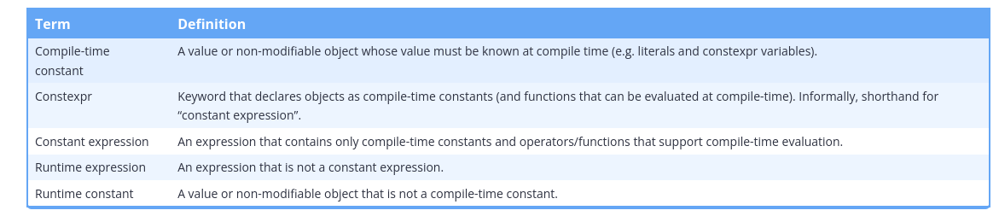

## The constexpr keyword

Fortunately, we can enlist the compiler’s help to ensure we get a compile-time constant variable where we desire one. To do so, we use the constexpr keyword (which is shorthand for “constant expression”) instead of const in a variable’s declaration. A constexpr variable is always a compile-time constant. As a result, a constexpr variable must be initialized with a constant expression, otherwise a compilation error will result.

```cpp
#include <iostream>

// The return value of a non-constexpr function is not constexpr
int five()
{
    return 5;
}

int main()
{
    constexpr double gravity { 9.8 }; // ok: 9.8 is a constant expression
    constexpr int sum { 4 + 5 };      // ok: 4 + 5 is a constant expression
    constexpr int something { sum };  // ok: sum is a constant expression

    std::cout << "Enter your age: ";
    int age{};
    std::cin >> age;

    constexpr int myAge { age };      // compile error: age is not a constant expression
    constexpr int f { five() };       // compile error: return value of five() is not constexpr

    return 0;
}
```

## The meaning of const vs constexpr for variables

For variables:

    const means that the value of an object cannot be changed after initialization. The value of the initializer may be known at compile-time or runtime. The const object can be evaluated at runtime.
    constexpr means that the object can be used in a constant expression. The value of the initializer must be known at compile-time. The constexpr object can be evaluated at runtime or compile-time.

Constexpr variables are implicitly const. Const variables are not implicitly constexpr (except for const integral variables with a constant expression initializer). Although a variable can be defined as both constexpr and const, in most cases this is redundant, and we only need to use either const or constexpr.

Unlike const, constexpr is not part of an object’s type. Therefore a variable defined as constexpr int actually has type const int (due to the implicit const that constexpr provides for objects).



## A brief introduction to constexpr functions

A constexpr function is a function that can be called in a constant expression. A constexpr function must evaluate at compile-time when the constant expression it is part of must evaluate at compile time (e.g. in the initializer of a constexpr variable). Otherwise, a constexpr function may be evaluated at either compile-time (if eligible) or runtime. To be eligible for compile-time execution, all arguments must be constant expressions.

To make a constexpr function, the constexpr keyword is placed in the function declaration before the return type:

```cpp
#include <iostream>

int max(int x, int y) // this is a non-constexpr function
{
    if (x > y)
        return x;
    else
        return y;
}

constexpr int cmax(int x, int y) // this is a constexpr function
{
    if (x > y)
        return x;
    else
        return y;
}

int main()
{
    int m1 { max(5, 6) };            // ok
    const int m2 { max(5, 6) };      // ok
    constexpr int m3 { max(5, 6) };  // compile error: max(5, 6) not a constant expression

    int m4 { cmax(5, 6) };           // ok: may evaluate at compile-time or runtime
    const int m5 { cmax(5, 6) };     // ok: may evaluate at compile-time or runtime
    constexpr int m6 { cmax(5, 6) }; // okay: must evaluate at compile-time

    return 0;
}
```