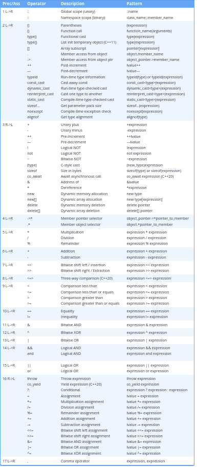

## Evaluation:

In order to evaluate an expression, the compiler must do two things:

    At compile time, the compiler must parse the expression and determine how operands are grouped with operators. This is done via the precedence and associativity rules, which we’ll discuss momentarily.
    At compile time or runtime, the operands are evaluated and operations executed to produce a result.

## Operator precedence

To assist with parsing a compound expression, all operators are assigned a level of precedence. Operators with a higher precedence level are grouped with operands first.

You can see in the table below that multiplication and division (precedence level 5) have a higher precedence level than addition and subtraction (precedence level 6). Thus, multiplication and division will be grouped with operands before addition and subtraction. In other words, 4 + 2 * 3 will be grouped as 4 + (2 * 3).

## Operator associativity

Consider a compound expression like 7 - 4 - 1. Should this be grouped as (7 - 4) - 1 which evaluates to 2, or 7 - (4 - 1), which evaluates to 4? Since both subtraction operators have the same precedence level, the compiler can not use precedence alone to determine how this should be grouped.

If two operators with the same precedence level are adjacent to each other in an expression, the operator’s associativity tells the compiler whether to evaluate the operators (not the operands!) from left to right or from right to left. Subtraction has precedence level 6, and the operators in precedence level 6 have an associativity of left to right. So this expression is grouped from left to right: (7 - 4) - 1.

So first off, compiler looks and notices that there are two operators that has same presedence level. And checks the definition of operator and notices that it should elevates this expression left to right. So it does first off (7-4) and then -1. Here is the definition of minus operator.

So every operation definition has these attributes:

Presedence level, connection direction, operand number and whether it is overloadable.

Here is the C++ definition in minus operator.


Note. We cannot devide not-existing operator that does not included in CPP. So we cannot work with, for instance: @ operation.
Here is the definition of some example operators and their instances:

We have example class GeneStrand.

```cpp
#include <iostream>
#include <string>
#include <algorithm> // For std::reverse
#include <stdexcept> // For std::runtime_error

/**
 * @class GeneStrand
 * Represents a sequence of genetic code (e.g., "ATCG").
 */
class GeneStrand {
public:
    std::string sequence;

    // Constructor
    GeneStrand(std::string s = "") : sequence(s) {
        for (char c : s) {
            if (c != 'A' && c != 'T' && c != 'C' && c != 'G') {
                throw std::runtime_error("Invalid gene sequence character.");
            }
        }
    }

    // Helper function to print the strand
    void print() const {
        std::cout << "GeneStrand(\"" << sequence << "\")" << std::endl;
    }

    // --- Operator Definitions ---

    /**
     * OPERATOR 1: The "Reverse Complement" Operator
     * Symbol: ~
     * Meaning: Creates the complementary strand (A->T, T->A, C->G, G->C)
     * and then reverses it.
     */
    GeneStrand operator~() const {
        std::string complemented = "";
        for (char c : this->sequence) {
            switch(c) {
                case 'A': complemented += 'T'; break;
                case 'T': complemented += 'A'; break;
                case 'C': complemented += 'G'; break;
                case 'G': complemented += 'C'; break;
            }
        }
        std::reverse(complemented.begin(), complemented.end());
        return GeneStrand(complemented);
    }

    /**
     * OPERATOR 2: The "Splice" Operator
     * Symbol: ^
     * Meaning: Combines two strands by taking the first half of the
     * left strand and the second half of the right strand.
     */
    GeneStrand operator^(const GeneStrand& other) const {
        size_t mid1 = this->sequence.length() / 2;
        size_t mid2 = other.sequence.length() / 2;
        
        std::string newSeq = this->sequence.substr(0, mid1) +
                             other.sequence.substr(mid2);
        return GeneStrand(newSeq);
    }

    /**
     * OPERATOR 3: The "Mutate Shift" Operator
     * Symbol: >>
     * Meaning: Performs a circular right-shift on the sequence
     * by 'k' positions.
     */
    GeneStrand operator>>(int k) const {
        if (this->sequence.empty()) {
            return GeneStrand("");
        }
        int n = this->sequence.length();
        int shift = k % n;
        if (shift < 0) shift += n; // Handle negative shifts

        std::string shifted = this->sequence.substr(n - shift) +
                              this->sequence.substr(0, n - shift);
        return GeneStrand(shifted);
    }
};

// --- Main Function with Examples ---

int main() {
    try {
        GeneStrand strand1("ATCGGCTA");
        GeneStrand strand2("TAGA");

        std::cout << "Originals:\n";
        strand1.print();
        strand2.print();
        std::cout << "----------\n" << std::endl;

        // Example 1: Using the '~' (Reverse Complement) operator
        std::cout << "Example 1: Reverse Complement (~strand1)\n";
        GeneStrand complemented = ~strand1;
        complemented.print(); // Expected: TAGCCGAT -> (Reversed) -> TAGCCGAT
        std::cout << "\n";

        // Example 2: Using the '^' (Splice) operator
        std::cout << "Example 2: Splice (strand1 ^ strand2)\n";
        // strand1 ("ATCGGCTA") -> first half is "ATCG"
        // strand2 ("TAGA")     -> second half is "GA"
        GeneStrand spliced = strand1 ^ strand2;
        spliced.print(); // Expected: "ATCGGA"
        std::cout << "\n";

        // Example 3: Using the '>>' (Mutate Shift) operator
        std::cout << "Example 3: Mutate Shift (strand1 >> 2)\n";
        // strand1 ("ATCGGCTA") >> 2 -> "TAATCGGC"
        GeneStrand shifted = strand1 >> 2;
        shifted.print(); // Expected: "TAATCGGC"
        std::cout << "\n";

    } catch (const std::exception& e) {
        std::cerr << "Error: " << e.what() << std::endl;
    }
    return 0;
}
```

Or check this example out:

```cpp
#include <iostream>

class Point {
public:
    int x, y;
    Point(int x = 0, int y = 0) : x(x), y(y) {}

    // --- 1. BINARY Operator as MEMBER Function ---
    // Operands: 2 (this, other)
    // Explicit Parameters: 1 (the 'other' object)
    // The left-hand operand 'p1' is implicitly passed as 'this'.
    Point operator+(const Point& other) const {
        std::cout << "Member operator+ called (1 parameter)\n";
        return Point(this->x + other.x, this->y + other.y);
    }

    // --- 2. UNARY Operator as MEMBER Function ---
    // Operands: 1 (this)
    // Explicit Parameters: 0
    // The single operand 'p1' is implicitly passed as 'this'.
    Point operator-() const {
        std::cout << "Member operator- (unary) called (0 parameters)\n";
        return Point(-this->x, -this.y);
    }
};

// --- 3. BINARY Operator as GLOBAL Function ---
// Operands: 2 (p1, p2)
// Explicit Parameters: 2 (p1, p2)
// No 'this' pointer, so BOTH operands must be passed as parameters.
Point operator*(const Point& p1, const Point& p2) {
    std::cout << "Global operator* called (2 parameters) <--- MAX\n";
    return Point(p1.x * p2.x, p1.y * p2.y);
}

// --- 4. UNARY Operator as GLOBAL Function ---
// Operands: 1 (p)
// Explicit Parameters: 1 (p)
// No 'this' pointer, so the single operand must be passed.
Point operator!(const Point& p) {
    std::cout << "Global operator! (unary) called (1 parameter)\n";
    return Point(p.y, p.x); // Swaps x and y
}

// --- Main Execution ---
int main() {
    Point p1(10, 5);
    Point p2(2, 3);

    // Calls MEMBER 'operator+' with 1 parameter (p2)
    // Compiler treats this as: p1.operator+(p2)
    Point p3 = p1 + p2;

    // Calls GLOBAL 'operator*' with 2 parameters (p1, p2)
    // Compiler treats this as: operator*(p1, p2)
    Point p4 = p1 * p2;

    // Calls MEMBER 'operator-' with 0 parameters
    // Compiler treats this as: p1.operator-()
    Point p5 = -p1;

    // Calls GLOBAL 'operator!' with 1 parameter (p1)
    // Compiler treats this as: operator!(p1)
    Point p6 = !p1;
}
```

We have presedence table for the all operators defined in CPP:




Note: sizeof() is an operator.

## Integer Divison or Float Point Division?

If either (or both) of the operands are floating point values, the division operator performs floating point division. Floating point division returns a floating point value, and the fraction is kept. For example, 7.0 / 4 = 1.75, 7 / 4.0 = 1.75, and 7.0 / 4.0 = 1.75. As with all floating point arithmetic operations, rounding errors may occur.

If both of the operands are integers, the division operator performs integer division instead. Integer division drops any fractions and returns an integer value. For example, 7 / 4 = 1 because the fractional portion of the result is dropped. Similarly, -7 / 4 = -1 because the fraction is dropped.

## Modifying and non-modifying operators

An operator that can modify the value of one of its operands is informally called a modifying operator. In C++, most operators are non-modifying -- they just use the operands to calculate and return a value. However, two categories of built-in operators do modify their left operand (as well as return a value):

## Remainder with negative numbers

The remainder operator can also work with negative operands. x % y always returns results with the sign of x.

## Where’s the exponent operator?

You’ll note that the ^ operator (commonly used to denote exponentiation in mathematics) is a Bitwise XOR operation in C++ (covered in lesson O.3 -- Bit manipulation with bitwise operators and bit masks). C++ does not include an exponent operator.

To do exponents in C++, #include the <cmath> header, and use the pow() function:
```cpp
#include <cmath>

double x{ std::pow(3.0, 4.0) }; // 3 to the 4th power
``` 
Note that the parameters (and return value) of function pow() are of type double. Due to rounding errors in floating point numbers, the results of pow() may not be precise (even if you pass it integers or whole numbers).
