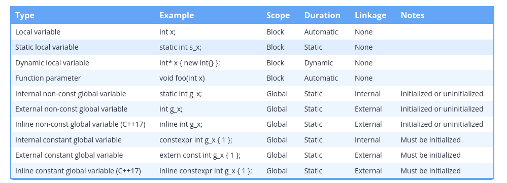
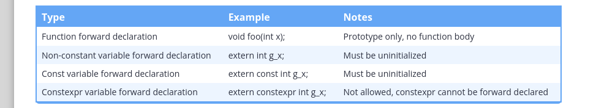

## Scope summary

An identifier’s scope determines where the identifier can be accessed within the source code.

    Variables with block (local) scope can only be accessed from the point of declaration until the end of the block in which they are declared (including nested blocks). This includes:
        Local variables
        Function parameters
        Program-defined type definitions (such as enums and classes) declared inside a block
    Variables and functions with global scope can be accessed from the point of declaration until the end of the file. This includes:
        Global variables
        Functions
        Program-defined type definitions (such as enums and classes) declared inside a namespace or in the global scope

## Duration summary

A variable’s duration determines when it is created and destroyed.

    Variables with automatic duration are created at the point of definition, and destroyed when the block they are part of is exited. This includes:
        Local variables
        Function parameters
    Variables with static duration are created when the program begins and destroyed when the program ends. This includes:
        Global variables
        Static local variables
    Variables with dynamic duration are created and destroyed by programmer request. This includes:
        Dynamically allocated variables

## Linkage summary

An identifier’s linkage determines whether a declaration of that same identifier in a different scope refers to the same entity (object, function, reference, etc…) or not.

Local variables have no linkage. Each declaration of an identifier with no linkage refers to a unique object or function.

    An identifier with no linkage means another declaration of the same identifier refers to a unique entity. Entities whose identifiers have no linkage include:
        Local variables
        Program-defined type identifiers (such as enums and classes) declared inside a block
    An identifier with internal linkage means a declaration of the same identifier within the same translation unit refers to the same object or function. Entities whose identifiers have internal linkage include:
        Static global variables (initialized or uninitialized)
        Static functions
        Const global variables
        Unnamed namespaces and anything defined within them
    An identifier with external linkage means a declaration of the same identifier within the entire program refers to the same object or function. Entities whose identifiers have external linkage include:
        Non-static functions
        Non-const global variables (initialized or uninitialized)
        Extern const global variables
        Inline const global variables
        Namespaces

Identifiers with external linkage will generally cause a duplicate definition linker error if the definitions are compiled into more than one .cpp file (due to violating the one-definition rule). There are some exceptions to this rule (for types, templates, and inline functions and variables) -- we’ll cover these further in future lessons when we talk about those topics.

Also note that functions have external linkage by default. They can be made internal by using the static keyword.

## Variable scope, duration, and linkage summary

## Forward declaration summary

You can use a forward declaration to access a function or variable in another file. The scope of the declared variable is as per usual (global scope for globals, block scope for locals).

A constexpr variable (which is implicitly const) can be forward declared using a const variable forward declaration. When accessed through the forward declaration, the variable will be considered const (not constexpr).

## What the heck is a storage class specifier?

When used as part of an identifier declaration, the static and extern keywords are called storage class specifiers. In this context, they set the storage duration and linkage of the identifier.

C++ supports 4 active storage class specifiers:

The term storage class specifier is typically only used in formal documentation.
