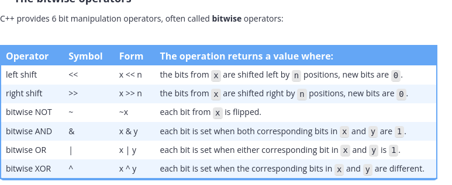

## What is bit manupulation?

Doing these things requires that we can manipulate objects at the bit level. Fortunately, C++ gives us tools to do precisely this. Modifying individual bits within an object is called bit manipulation.

## Bit sets?

To define a set of bit flags, we’ll typically use an unsigned integer of the appropriate size (8 bits, 16 bits, 32 bits, etc… depending on how many flags we have), or std::bitset.
```cpp
#include <bitset> // for std::bitset

std::bitset<8> mybitset {}; // 8 bits in size means room for 8 flags
```

## Manipulating bits via std::bitset

std::bitset provides 4 key member functions that are useful for doing bit manipulation:

    test() allows us to query whether a bit is a 0 or 1.
    set() allows us to turn a bit on (this will do nothing if the bit is already on).
    reset() allows us to turn a bit off (this will do nothing if the bit is already off).
    flip() allows us to flip a bit value from a 0 to a 1 or vice versa.


```cpp
#include <bitset>
#include <iostream>

int main()
{
    std::bitset<8> bits{ 0b0000'0101 }; // we need 8 bits, start with bit pattern 0000 0101
    bits.set(3);   // set bit position 3 to 1 (now we have 0000 1101)
    bits.flip(4);  // flip bit 4 (now we have 0001 1101)
    bits.reset(4); // set bit 4 back to 0 (now we have 0000 1101)

    std::cout << "All the bits: " << bits<< '\n';
    std::cout << "Bit 3 has value: " << bits.test(3) << '\n';
    std::cout << "Bit 4 has value: " << bits.test(4) << '\n';

    return 0;
}
```

```plaintext
All the bits: 00001101
Bit 3 has value: 1
Bit 4 has value: 0
```


```cpp
#include <bitset>
#include <iostream>

int main()
{
    [[maybe_unused]] constexpr int  isHungry   { 0 };
    [[maybe_unused]] constexpr int  isSad      { 1 };
    [[maybe_unused]] constexpr int  isMad      { 2 };
    [[maybe_unused]] constexpr int  isHappy    { 3 };
    [[maybe_unused]] constexpr int  isLaughing { 4 };
    [[maybe_unused]] constexpr int  isAsleep   { 5 };
    [[maybe_unused]] constexpr int  isDead     { 6 };
    [[maybe_unused]] constexpr int  isCrying   { 7 };

    std::bitset<8> me{ 0b0000'0101 }; // we need 8 bits, start with bit pattern 0000 0101
    me.set(isHappy);      // set bit position 3 to 1 (now we have 0000 1101)
    me.flip(isLaughing);  // flip bit 4 (now we have 0001 1101)
    me.reset(isLaughing); // set bit 4 back to 0 (now we have 0000 1101)

    std::cout << "All the bits: " << me << '\n';
    std::cout << "I am happy: " << me.test(isHappy) << '\n';
    std::cout << "I am laughing: " << me.test(isLaughing) << '\n';

    return 0;
}
```

## The size of std::bitset

One potential surprise is that std::bitset is optimized for speed, not memory savings. The size of a std::bitset is typically the number of bytes needed to hold the bits, rounded up to the nearest sizeof(size_t), which is 4 bytes on 32-bit machines, and 8-bytes on 64-bit machines.

Thus, a std::bitset<8> will typically use either 4 or 8 bytes of memory, even though it technically only needs 1 byte to store 8 bits. Thus, std::bitset is most useful when we desire convenience, not memory savings.


Querying std::bitset

There are a few other member functions that are often useful:

    size() returns the number of bits in the bitset.
    count() returns the number of bits in the bitset that are set to true.
    all() returns a Boolean indicating whether all bits are set to true.
    any() returns a Boolean indicating whether any bits are set to true.
    none() returns a Boolean indicating whether no bits are set to true.

```cpp
#include <bitset>
#include <iostream>

int main()
{
    std::bitset<8> bits{ 0b0000'1101 };
    std::cout << bits.size() << " bits are in the bitset\n";
    std::cout << bits.count() << " bits are set to true\n";

    std::cout << std::boolalpha;
    std::cout << "All bits are true: " << bits.all() << '\n';
    std::cout << "Some bits are true: " << bits.any() << '\n';
    std::cout << "No bits are true: " << bits.none() << '\n';

    return 0;
}
```

This prints:
```plaintext
8 bits are in the bitset
3 bits are set to true
All bits are true: false
Some bits are true: true
No bits are true: false
```

## Bitwise operators:



