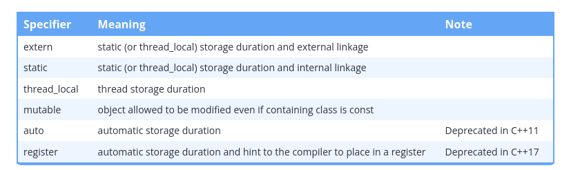

## What is bit manupulation?

Doing these things requires that we can manipulate objects at the bit level. Fortunately, C++ gives us tools to do precisely this. Modifying individual bits within an object is called bit manipulation.

## Bit sets?

To define a set of bit flags, we’ll typically use an unsigned integer of the appropriate size (8 bits, 16 bits, 32 bits, etc… depending on how many flags we have), or std::bitset.
```cpp
#include <bitset> // for std::bitset

std::bitset<8> mybitset {}; // 8 bits in size means room for 8 flags
```

## Manipulating bits via std::bitset

std::bitset provides 4 key member functions that are useful for doing bit manipulation:

    test() allows us to query whether a bit is a 0 or 1.
    set() allows us to turn a bit on (this will do nothing if the bit is already on).
    reset() allows us to turn a bit off (this will do nothing if the bit is already off).
    flip() allows us to flip a bit value from a 0 to a 1 or vice versa.


```cpp
#include <bitset>
#include <iostream>

int main()
{
    std::bitset<8> bits{ 0b0000'0101 }; // we need 8 bits, start with bit pattern 0000 0101
    bits.set(3);   // set bit position 3 to 1 (now we have 0000 1101)
    bits.flip(4);  // flip bit 4 (now we have 0001 1101)
    bits.reset(4); // set bit 4 back to 0 (now we have 0000 1101)

    std::cout << "All the bits: " << bits<< '\n';
    std::cout << "Bit 3 has value: " << bits.test(3) << '\n';
    std::cout << "Bit 4 has value: " << bits.test(4) << '\n';

    return 0;
}
```

```plaintext
All the bits: 00001101
Bit 3 has value: 1
Bit 4 has value: 0
```


```cpp
#include <bitset>
#include <iostream>

int main()
{
    [[maybe_unused]] constexpr int  isHungry   { 0 };
    [[maybe_unused]] constexpr int  isSad      { 1 };
    [[maybe_unused]] constexpr int  isMad      { 2 };
    [[maybe_unused]] constexpr int  isHappy    { 3 };
    [[maybe_unused]] constexpr int  isLaughing { 4 };
    [[maybe_unused]] constexpr int  isAsleep   { 5 };
    [[maybe_unused]] constexpr int  isDead     { 6 };
    [[maybe_unused]] constexpr int  isCrying   { 7 };

    std::bitset<8> me{ 0b0000'0101 }; // we need 8 bits, start with bit pattern 0000 0101
    me.set(isHappy);      // set bit position 3 to 1 (now we have 0000 1101)
    me.flip(isLaughing);  // flip bit 4 (now we have 0001 1101)
    me.reset(isLaughing); // set bit 4 back to 0 (now we have 0000 1101)

    std::cout << "All the bits: " << me << '\n';
    std::cout << "I am happy: " << me.test(isHappy) << '\n';
    std::cout << "I am laughing: " << me.test(isLaughing) << '\n';

    return 0;
}
```

## The size of std::bitset

One potential surprise is that std::bitset is optimized for speed, not memory savings. The size of a std::bitset is typically the number of bytes needed to hold the bits, rounded up to the nearest sizeof(size_t), which is 4 bytes on 32-bit machines, and 8-bytes on 64-bit machines.

Thus, a std::bitset<8> will typically use either 4 or 8 bytes of memory, even though it technically only needs 1 byte to store 8 bits. Thus, std::bitset is most useful when we desire convenience, not memory savings.


Querying std::bitset

There are a few other member functions that are often useful:

    size() returns the number of bits in the bitset.
    count() returns the number of bits in the bitset that are set to true.
    all() returns a Boolean indicating whether all bits are set to true.
    any() returns a Boolean indicating whether any bits are set to true.
    none() returns a Boolean indicating whether no bits are set to true.

```cpp
#include <bitset>
#include <iostream>

int main()
{
    std::bitset<8> bits{ 0b0000'1101 };
    std::cout << bits.size() << " bits are in the bitset\n";
    std::cout << bits.count() << " bits are set to true\n";

    std::cout << std::boolalpha;
    std::cout << "All bits are true: " << bits.all() << '\n';
    std::cout << "Some bits are true: " << bits.any() << '\n';
    std::cout << "No bits are true: " << bits.none() << '\n';

    return 0;
}
```

This prints:
```plaintext
8 bits are in the bitset
3 bits are set to true
All bits are true: false
Some bits are true: true
No bits are true: false
```

## Bitwise operators:


## Identifier resolution from within a namespace

If an identifier inside a namespace is used and no scope resolution is provided, the compiler will first try to find a matching declaration in that same namespace. If no matching identifier is found, the compiler will then check each containing namespace in sequence to see if a match is found, with the global namespace being checked last.
```cpp
#include <iostream>

void print() // this print() lives in the global namespace
{
	std::cout << " there\n";
}

namespace Foo
{
	void print() // this print() lives in the Foo namespace
	{
		std::cout << "Hello";
	}

	void printHelloThere()
	{
		print();   // calls print() in Foo namespace
		::print(); // calls print() in global namespace
	}
}

int main()
{
	Foo::printHelloThere();

	return 0;
}
```
This prints:
```plaintext
Hello there
```
In the above example, print() is called with no scope resolution provided. Because this use of print() is inside the Foo namespace, the compiler will first see if a declaration for Foo::print() can be found. Since one exists, Foo::print() is called.


## Variable shadowing:

```cpp
#include <iostream>

int main()
{ // outer block
    int apples { 5 }; // here's the outer block apples

    { // nested block
        // apples refers to outer block apples here
        std::cout << apples << '\n'; // print value of outer block apples

        int apples{ 0 }; // define apples in the scope of the nested block

        // apples now refers to the nested block apples
        // the outer block apples is temporarily hidden

        apples = 10; // this assigns value 10 to nested block apples, not outer block apples

        std::cout << apples << '\n'; // print value of nested block apples
    } // nested block apples destroyed


    std::cout << apples << '\n'; // prints value of outer block apples

    return 0;
} // outer block apples destroyed
```


## External vs Internal:

An identifier with **external linkage** can be seen and used both from the file in which it is defined, and from other code files (via a forward declaration). In this sense, identifiers with external linkage are truly “global” in that they can be used anywhere in your program!

## Functions have external linkage by default

In lesson 2.8 -- Programs with multiple code files, you learned that you can call a function defined in one file from another file. This is because functions have external linkage by default.

In order to call a function defined in another file, you must place a forward declaration for the function in any other files wishing to use the function. The forward declaration tells the compiler about the existence of the function, and the linker connects the function calls to the actual function definition.


## Global variables with external linkage

Global variables with external linkage are sometimes called external variables. To make a global variable external (and thus accessible by other files), we can use the extern keyword to do so:

```cpp
int g_x { 2 }; // non-constant globals are external by default (no need to use extern)

extern const int g_y { 3 }; // const globals can be defined as extern, making them external
extern constexpr int g_z { 3 }; // constexpr globals can be defined as extern, making them external (but this is pretty useless, see the warning in the next section)

int main()
{
    return 0;
}
```

**Non-const global variables are external by default, so we don’t need to mark them as extern.**


## Variable forward declarations via the extern keyword

To actually use an external global variable that has been defined in another file, you also must place a forward declaration for the global variable in any other files wishing to use the variable. For variables, creating a forward declaration is also done via the extern keyword (with no initialization value).

Here is an example of using variable forward declarations:

main.cpp:


```cpp
#include <iostream>

extern int g_x;       // this extern is a forward declaration of a variable named g_x that is defined somewhere else
extern const int g_y; // this extern is a forward declaration of a const variable named g_y that is defined somewhere else

int main()
{
    std::cout << g_x << ' ' << g_y << '\n'; // prints 2 3

    return 0;
}
```


Here’s the definitions for those variables:

a.cpp:
```cpp
// global variable definitions
int g_x { 2 };              // non-constant globals have external linkage by default
extern const int g_y { 3 }; // this extern gives g_y external linkage
```
In the above example, a.cpp and main.cpp both reference the same global variable named g_x. So even though g_x is defined and initialized in a.cpp, we are able to use its value in main.cpp via the forward declaration of g_x.

## Note:

Note that the extern keyword has different meanings in different contexts. In some contexts, extern means “give this variable external linkage”. In other contexts, extern means “this is a forward declaration for an external variable that is defined somewhere else”. Yes, this is confusing, so we summarize all of these usages in lesson 


Note that function forward declarations don’t need the extern keyword -- the compiler is able to tell whether you’re defining a new function or making a forward declaration based on whether you supply a function body or not. Variables forward declarations do need the extern keyword to help differentiate uninitialized variables definitions from variable forward declarations (they look otherwise identical):

```cpp
// non-constant
int g_x;        // variable definition (no initializer)
int g_x { 1 };  // variable definition (w/ initializer)
extern int g_x; // forward declaration (no initializer)

// constant
extern const int g_y { 1 }; // variable definition (const requires initializers)
extern const int g_y;       // forward declaration (no initializer)
```
## Avoid using extern on a non-const global variable with an initializer

The following two lines are semantically equivalent:
```cpp
int g_x { 1 };        // extern by default
extern int g_x { 1 }; // explicitly extern (may cause compiler warning)
```

However, your compiler may issue a warning about the latter statement, even though it is technically valid.

Remember when we said compilers have the leeway to issue a diagnostic for things they find suspicious? This is one of those cases. Conventionally, extern is applied to a non-const variable when we want a forward declaration. However, adding an initializer makes the statement a definition instead. The compiler is telling you that something seems amiss. To correct it, either remove the initializer (if you intended a forward declaration) or remove the extern (if you intended a definition).

Best practice

Only use extern for global variable forward declarations or const global variable definitions.
Do not use extern for non-const global variable definitions (they are implicitly extern).

## Quick summary
```cpp
// Global variable forward declarations (extern w/ no initializer):
extern int g_y;                 // forward declaration for non-constant global variable
extern const int g_y;           // forward declaration for const global variable
extern constexpr int g_y;       // not allowed: constexpr variables can't be forward declared

// External global variable definitions (no extern)
int g_x;                        // defines non-initialized external global variable (zero initialized by default)
int g_x { 1 };                  // defines initialized external global variable

// External const global variable definitions (extern w/ initializer)
extern const int g_x { 2 };     // defines initialized const external global variable
extern constexpr int g_x { 3 }; // defines initialized constexpr external global variable
```

We provide a comprehensive summary in lesson 7.12 -- Scope, duration, and linkage summary.


## The initialization order problem of global variables

Initialization of static variables (which includes global variables) happens as part of program startup, before execution of the main function. This proceeds in two phases.

The first phase is called static initialization. Static initialization proceeds in two phases:

    Global variables with constexpr initializers (including literals) are initialized to those values. This is called constant initialization.
    Global variables without initializers are zero-initialized. Zero-initialization is considered to be a form of static-initialization since 0 is a constexpr value.

The second phase is called dynamic initialization. This phase is more complex and nuanced, but the gist of it is that global variables with non-constexpr initializers are initialized.

Here’s an example of a non-constexpr initializer:

int init()
{
    return 5;
}

int g_something{ init() }; // non-constexpr initialization

Within a single file, for each phase, global variables are generally initialized in order of definition (there are a few exceptions to this rule for the dynamic initialization phase). Given this, you need to be careful not to have variables dependent on the initialization value of other variables that won’t be initialized until later. For example:

```cpp
#include <iostream>

int initX();  // forward declaration
int initY();  // forward declaration

int g_x{ initX() }; // g_x is initialized first
int g_y{ initY() };

int initX()
{
    return g_y; // g_y isn't initialized when this is called
}

int initY()
{
    return 5;
}

int main()
{
    std::cout << g_x << ' ' << g_y << '\n';
}
```
```plaintext
0 5
```

Much more of a problem, the order in which static objects are initialized across different translation units is ambiguous.

Given two files, a.cpp and b.cpp, either could have its global variables initialized first. If some variable with static duration in a.cpp is initialized with a static duration variable defined in b.cpp, there’s a 50% chance that the variable in b.cpp won’t be initialized yet.

## Inline functions:

Think about a function do actually little work but for enhancing readibilty you define it in a function. Like max of a two numbers.
As you might guess in actual it would be greate just copying and pasting that function in the aspect of performance. So this is why we should use keyword ```inline```. Check this function out:

```cpp
inline int max(int a, int b){
    return a > b ? a : b;
}
```
So if we would not have used ```inline``` keyword in this function compiler would had have to follow these steps:

1. First off, the CPU must store the address of the current instruction it is executing 
2. Then parameters x and y must be instantiated and then initialized. 
3. Then the execution path has to jump to the code in the max() function. 
4. When the function ends, the program has to jump back to the location of the function call.
5. And the return value has to be copied so it can be output.

All this journey is called as **overhead**.

So using ```inline``` keyword we are getting rid of this type of calls. But then why dont we use ```inline``` every function that we encounter? Because for functions that are large and/or perform complex tasks, the overhead of the function call is typically insignificant compared to the amount of time the function takes to run. 

So what does actually ```inline``` keyword do?

Inline expansion is a process where a function call is replaced by the code from the called function’s definition.

But we cannot use ```inline``` keyword everywhere.

However, inline expansion has its own potential cost: if the body of the function being expanded takes more instructions than the function call being replaced, then each inline expansion will cause the executable to grow larger. Larger executables tend to be slower (due to not fitting as well in memory caches).

But however in most and modern compilers it generally does not care about whether you mark the functions as inline or not. It will decide by itself.

## But know Inline is not used for requesting compiler that this functions might be used in inline.

But know, in modern cpp environment we use in order for telling the compiler that `I might declare this function multiple times.` do not see it as an error.

So by that we can declare mini functions in header files and since compiler will assume that they are same. (Even though it encounter multiple definitions of a function)


Global constants as inline variables C++17

In lesson 7.9 -- Inline functions and variables, we covered inline variables, which are variables that can have more than one definition, so long as those definitions are identical. By making our constexpr variables inline, we can define them in a header file and then #include them into any .cpp file that requires them. This avoids both ODR violations and the downside of duplicated variables.

A reminder

Constexpr functions are implicitly inline, but constexpr variables are not implicitly inline. If you want an inline constexpr variable, you must explicitly mark it as inline.

Key insight

Inline variables have external linkage by default, so that they are visible to the linker. This is necessary so the linker can de-duplicate the definitions.

Non-inline constexpr variables have internal linkage. If included into multiple translation units, each translation unit will get its own copy of the variable. This is not an ODR violation because they are not exposed to the linker.

constants.h:
```cpp

#ifndef CONSTANTS_H
#define CONSTANTS_H

// define your own namespace to hold constants
namespace constants
{
    inline constexpr double pi { 3.14159 }; // note: now inline constexpr
    inline constexpr double avogadro { 6.0221413e23 };
    inline constexpr double myGravity { 9.2 }; // m/s^2 -- gravity is light on this planet
    // ... other related constants
}
#endif

main.cpp:

#include "constants.h"

#include <iostream>

int main()
{
    std::cout << "Enter a radius: ";
    double radius{};
    std::cin >> radius;

    std::cout << "The circumference is: " << 2 * radius * constants::pi << '\n';

    return 0;
}
```
We can include constants.h into as many code files as we want, but these variables will only be instantiated once and shared across all code files.

This method does retain the downside of requiring every file that includes the constants header be recompiled if any constant value is changed.

Advantages:

    Can be used in constant expressions in any translation unit that includes them.
    Only one copy of each variable is required.


## Static keyworad

Static keyword gives internal linkage.

By static keyword. Initialization done once.

```cpp
#include <iostream>

void incrementAndPrint()
{
    static int s_value{ 1 }; // static duration via static keyword.  This initializer is only executed once.
    ++s_value;
    std::cout << s_value << '\n';
} // s_value is not destroyed here, but becomes inaccessible because it goes out of scope

int main()
{
    incrementAndPrint();
    incrementAndPrint();
    incrementAndPrint();

    return 0;
}
#include <iostream>

void incrementAndPrint()
{
    static int s_value{ 1 }; // static duration via static keyword.  This initializer is only executed once.
    ++s_value;
    std::cout << s_value << '\n';
} // s_value is not destroyed here, but becomes inaccessible because it goes out of scope

int main()
{
    incrementAndPrint();
    incrementAndPrint();
    incrementAndPrint();

    return 0;
}
```

Note: Static local variables that are zero-initialized or have a constexpr initializer can be initialized at program start.

## Scope summary

An identifier’s scope determines where the identifier can be accessed within the source code.

    Variables with block (local) scope can only be accessed from the point of declaration until the end of the block in which they are declared (including nested blocks). This includes:
        Local variables
        Function parameters
        Program-defined type definitions (such as enums and classes) declared inside a block
    Variables and functions with global scope can be accessed from the point of declaration until the end of the file. This includes:
        Global variables
        Functions
        Program-defined type definitions (such as enums and classes) declared inside a namespace or in the global scope

## Duration summary

A variable’s duration determines when it is created and destroyed.

    Variables with automatic duration are created at the point of definition, and destroyed when the block they are part of is exited. This includes:
        Local variables
        Function parameters
    Variables with static duration are created when the program begins and destroyed when the program ends. This includes:
        Global variables
        Static local variables
    Variables with dynamic duration are created and destroyed by programmer request. This includes:
        Dynamically allocated variables


## Linkage summary

An identifier’s linkage determines whether a declaration of that same identifier in a different scope refers to the same entity (object, function, reference, etc…) or not.

Local variables have no linkage. Each declaration of an identifier with no linkage refers to a unique object or function.

    An identifier with no linkage means another declaration of the same identifier refers to a unique entity. Entities whose identifiers have no linkage include:
        Local variables
        Program-defined type identifiers (such as enums and classes) declared inside a block
    An identifier with internal linkage means a declaration of the same identifier within the same translation unit refers to the same object or function. Entities whose identifiers have internal linkage include:
        Static global variables (initialized or uninitialized)
        Static functions
        Const global variables
        Unnamed namespaces and anything defined within them
    An identifier with external linkage means a declaration of the same identifier within the entire program refers to the same object or function. Entities whose identifiers have external linkage include:
        Non-static functions
        Non-const global variables (initialized or uninitialized)
        Extern const global variables
        Inline const global variables
        Namespaces

Identifiers with external linkage will generally cause a duplicate definition linker error if the definitions are compiled into more than one .cpp file (due to violating the one-definition rule). There are some exceptions to this rule (for types, templates, and inline functions and variables) -- we’ll cover these further in future lessons when we talk about those topics.

Also note that functions have external linkage by default. They can be made internal by using the static keyword.

## Variable scope, duration, and linkage summary


## Forward declaration summary

You can use a forward declaration to access a function or variable in another file. The scope of the declared variable is as per usual (global scope for globals, block scope for locals).


A constexpr variable (which is implicitly const) can be forward declared using a const variable forward declaration. When accessed through the forward declaration, the variable will be considered const (not constexpr).

## What the heck is a storage class specifier?

When used as part of an identifier declaration, the static and extern keywords are called storage class specifiers. In this context, they set the storage duration and linkage of the identifier.

C++ supports 4 active storage class specifiers:



The term storage class specifier is typically only used in formal documentation.

## Qualified and unqualified name.


Qualified names are explicitly declaring that this object or functions coming from this object or namespace. Examples are:

```cpp
std::cout
object.x
this->myfunction();
```

Unqualified ares vice versa of them.

```cpp
cout
x
```

Or any other thing.

## Using-declarations

For instance: using std::cout means that everywhere that compiler encounter cout, it is coming from std namespace. 

If there’s a naming conflict between std::cout and some other use of cout that is visible from within main(), std::cout will be preferred. 

Example:

```cpp
#include <iostream>

int main()
{
   using std::cout; // this using declaration tells the compiler that cout should resolve to std::cout
   cout << "Hello world!\n"; // so no std:: prefix is needed here!

   return 0;
} // the using declaration expires at the end of the current scope
```

This doesn’t save much effort in this trivial example, but if you are using cout many times inside of a function, a using-declaration can make your code more readable. Note that you will need a separate using-declaration for each name (e.g. one for std::cout, one for std::cin, etc…).

The using-declaration is active from the point of declaration to the end of the scope in which it is declared.

## Using-directives

Another way to simplify things is to use a using-directive. A using directive allows **all** identifiers in a given namespace to be referenced without qualification from the scope of the using-directive.


```cpp
#include <iostream>

int main()
{
   using namespace std; // all names from std namespace now accessible without qualification
   cout << "Hello world!\n"; // so no std:: prefix is needed here

   return 0;
} // the using-directive ends at the end of the current scope
```

Check this situation:

There is a more insidious version of this problem that can occur as well. The updated library may introduce a function that not only has the same name, but is actually a better match for some function call. In such a case, the compiler may decide to prefer the new function instead, and the behavior of your program will change unexpectedly and silently.

Consider the following program:

Foolib.h (part of some third-party library):

```cpp
#ifndef FOOLIB_H
#define FOOLIB_H

namespace Foo
{
    int a { 20 };
}
#endif
```

```cpp
#include <iostream>
#include <Foolib.h> // a third-party library we installed outside our project directory, thus angled brackets used

int get(long)
{
    return 1;
}

int main()
{
    using namespace Foo; // Because we're lazy and want to access Foo:: qualified names without typing the Foo:: prefix
    std::cout << a << '\n'; // uses Foo::a

    std::cout << get(0) << '\n'; // calls ::get(long)

    return 0;
}
```

This program runs and prints 1.

Now, let’s say we update the Foolib library, which includes an updated Foolib.h that looks like this:

Foolib.h (updated):
```cpp
#ifndef FOOLIB_H
#define FOOLIB_H

namespace Foo
{
    int a { 20 };

    int get(int) { return 2; } // new function added
}
#endif
```
Once again, our main.cpp file hasn’t changed at all, but this program now compiles, runs, and prints 2!

When the compiler encounters a function call, it has to determine what function definition it should match the function call with. In selecting a function from a set of potentially matching functions, it will prefer a function that requires no argument conversions over a function that requires argument conversions. Because the literal 0 is an integer, C++ will prefer to match print(0) with the newly introduced print(int) (no conversions) over print(long) (which requires a conversion from int to long). That causes an unexpected change to our program behavior.