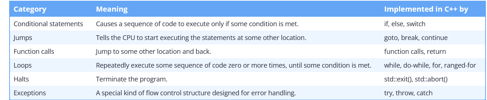

## What is Straight-Line Program:

Straight-line programs take the same path (execute the same statements in the same order) every time they are run.

## Branching?

When a control flow statement causes point of execution to change to a non-sequential statement, this is called branching.

Example:

```cpp
#include <iostream>

int main() {
    int x = 10;

    std::cout << "This line works everytime." << std::endl;

    // Branching
    if (x > 5) 
        std::cout << "x, is larger then 5" << std::endl;
     else 
        std::cout << "x, is less then 5" << std::endl;
    

    std::cout << "This line works everytime also." << std::endl;

    return 0;
}
```

Control Flow:




## Nested if-statements and the dangling else problem

```cpp
#include <iostream>

int main()
{
    std::cout << "Enter a number: ";
    int x{};
    std::cin >> x;

    if (x >= 0) // outer if-statement
        // it is bad coding style to nest if statements this way
        if (x <= 20) // inner if-statement
            std::cout << x << " is between 0 and 20\n";

    // which if statement does this else belong to?
    else
        std::cout << x << " is negative\n";

    return 0;
}
```

The above program introduces a source of potential ambiguity called a **dangling else** problem. Is the else-statement in the above program matched up with the outer or inner if-statement?

The answer is that an else-statement is paired up with the last unmatched if-statement in the same block. Thus, in the program above, the else-statement is matched up with the inner if-statement, as if the program had been written like this:

```cpp
#include <iostream>

int main()
{
    std::cout << "Enter a number: ";
    int x{};
    std::cin >> x;

    if (x >= 0) // outer if statement
    {
        if (x <= 20) // inner if statement
            std::cout << x << " is between 0 and 20\n";
        else // attached to inner if statement
            std::cout << x << " is negative\n";
    }

    return 0;
}
```

## Swith-case syntax:


```cpp
#include <iostream>

void printDigitName(int x)
{
    switch (x)
    {
    case 1:
        std::cout << "One";
        return;
    case 2:
        std::cout << "Two";
        return;
    case 3:
        std::cout << "Three";
        return;
    default:
        std::cout << "Unknown";
        return;
    }
}

int main()
{
    printDigitName(2);
    std::cout << '\n';

    return 0;
}
```
Then one of the following occurs:

    If the expression’s value is equal to the value after any of the case-labels, the statements after the matching case-label are executed.
    If no matching value can be found and a default label exists, the statements after the default label are executed.
    If no matching value can be found and there is no default label, the switch is skipped.


The condition in a switch must evaluate to an integral type (see lesson 4.1 -- Introduction to fundamental data types if you need a reminder which fundamental types are considered integral types) 


Note: Integral Types are: int, char, short, long, long long and unsigned variation of them.


or an enumerated type (covered in future lessons 13.2 -- Unscoped enumerations and 13.6 -- Scoped enumerations (enum classes)),

enum Status { WORKING, IDLE, STOP };

enum class Color { Red, Green, Blue };


or be convertible to one. Expressions that evaluate to floating point types, strings, and most other non-integral types may not be used here.


## Case keyword

Case keyword should get an constant expression.

## Taking a break

In the above examples, we used return-statements to stop execution of the statements after our labels. However, this also exits the entire function.

A break statement (declared using the break keyword) tells the compiler that we are done executing statements within the switch, and that execution should continue with the statement after the end of the switch block. This allows us to exit a switch-statement without exiting the entire function.

## Switch vs if-else

Switch statements are best used when there is a single expression (with a non-boolean integral type or an enumerated type) we want to evaluate for equality against a small number of values. If the number of case labels gets too large, the switch can be hard to read.

Compared to the equivalent if-else statements, a switch-statement can be more readable, makes it clearer that it is the same expression being tested for equality in each case, and has the advantage of only evaluating the expression once (making it more efficient).

However, if-else is significantly more flexible. Some cases where if or if-else is typically better:

    Testing an expression for comparisons other than equality (e.g. x > 5)
    Testing multiple conditions (e.g. x == 5 && y == 6)
    Determining whether a value is within a range (e.g. x >= 5 && x <= 10)
    The expression has a type that switch doesn’t support (e.g. d == 4.0).
    The expression evaluates to a bool.

    ## Fallthrough of Switch

When a switch expression matches a case label or optional default label, execution begins at the first statement following the matching label. Execution will then continue sequentially until one of the following termination conditions happens:

    The end of the switch block is reached.
    Another control flow statement (typically a break or return) causes the switch block or function to exit.
    Something else interrupts the normal flow of the program (e.g. the OS shuts the program down, the universe implodes, etc…)

Note that the presence of another case label is not one of these terminating conditions -- thus, without a break or return, execution will overflow into subsequent cases.

Here is a program that exhibits this behavior:

```cpp

#include <iostream>

int main()
{
    switch (2)
    {
    case 1: // Does not match
        std::cout << 1 << '\n'; // Skipped
    case 2: // Match!
        std::cout << 2 << '\n'; // Execution begins here
    case 3:
        std::cout << 3 << '\n'; // This is also executed
    case 4:
        std::cout << 4 << '\n'; // This is also executed
    default:
        std::cout << 5 << '\n'; // This is also executed
    }

    return 0;
}
```

This program outputs the following:
```plaintext
2
3
4
5
```

## The [[fallthrough]] attribute

Commenting intentional fallthrough is a common convention to tell other developers that fallthrough is intended. While this works for other developers, the compiler and code analysis tools don’t know how to interpret comments, so it won’t get rid of the warnings.

To help address this, C++17 adds a new attribute called [[fallthrough]].

Attributes are a modern C++ feature that allows the programmer to provide the compiler with some additional data about the code. To specify an attribute, the attribute name is placed between double brackets. Attributes are not statements -- rather, they can be used almost anywhere where they are contextually relevant.

The [[fallthrough]] attribute modifies a null statement to indicate that fallthrough is intentional (and no warnings should be triggered):
```cpp
#include <iostream>

int main()
{
    switch (2)
    {
    case 1:
        std::cout << 1 << '\n';
        break;
    case 2:
        std::cout << 2 << '\n'; // Execution begins here
        [[fallthrough]]; // intentional fallthrough -- note the semicolon to indicate the null statement
    case 3:
        std::cout << 3 << '\n'; // This is also executed
        break;
    }

    return 0;
}
```

## Sequential case labels

```cpp
bool isVowel(char c)
{
    switch (c)
    {
    case 'a': // if c is 'a'
    case 'e': // or if c is 'e'
    case 'i': // or if c is 'i'
    case 'o': // or if c is 'o'
    case 'u': // or if c is 'u'
    case 'A': // or if c is 'A'
    case 'E': // or if c is 'E'
    case 'I': // or if c is 'I'
    case 'O': // or if c is 'O'
    case 'U': // or if c is 'U'
        return true;
    default:
        return false;
    }
}
```

## Labels do not define a new scope

## Variable declaration and initialization inside case statements

Note switch force compiler to JUMP to corresponding case stament. Does not execute others.

```cpp
switch (1)
{
    int a; // okay: definition is allowed before the case labels
    int b{ 5 }; // illegal: initialization is not allowed before the case labels

case 1:
    int y; // okay but bad practice: definition is allowed within a case
    y = 4; // okay: assignment is allowed
    break;

case 2:
    int z{ 4 }; // illegal: initialization is not allowed if subsequent cases exist
    y = 5; // okay: y was declared above, so we can use it here too
    break;

case 3:
    break;
}
```

Solution?

```cpp
switch (1)
{
case 1:
{ // note addition of explicit block here
    int x{ 4 }; // okay, variables can be initialized inside a block inside a case
    std::cout << x;
    break;
}

default:
    std::cout << "default case\n";
    break;
}
```